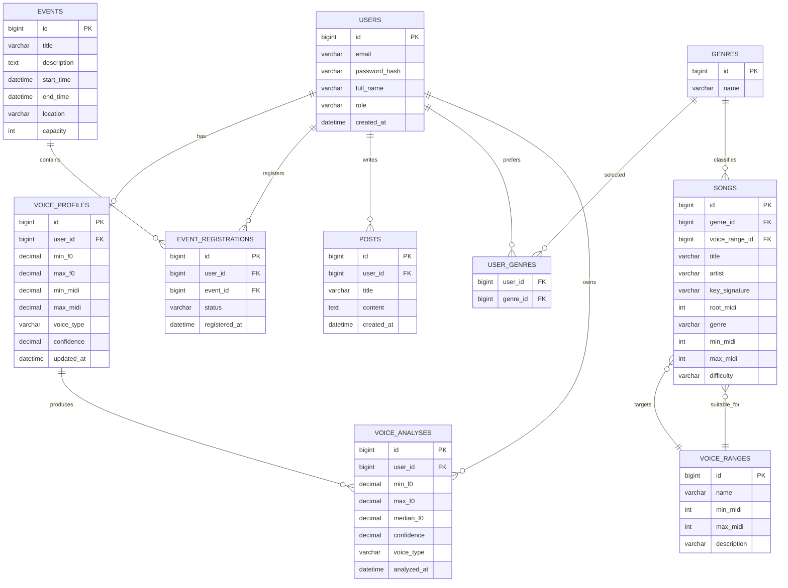

# ROADMAP 100 NGÀY
## Đề tài
**Nghiên cứu ứng dụng kỹ thuật phân tích tần số âm thanh F₀ tự động nhận diện Tông giọng và gợi ý bài hát theo thể loại cho hệ thống quản lý Câu lạc bộ Âm nhạc đa nền tảng**

> **Mục tiêu:** Hoàn thành một đồ án có giá trị nghiên cứu rõ ràng nhưng thực tế cho **2 sinh viên trong 100 ngày**, ưu tiên thuật toán F₀/pitch detection, nhận diện voice range, recommendation; sau đó tích hợp Backend, Mobile và Admin.

---

# 1. Nguyên tắc triển khai

## 1.1. Ưu tiên nghiên cứu

Thứ tự ưu tiên:

1. Thu thập dữ liệu và hiểu đặc tính tín hiệu giọng hát.
2. F₀ / pitch detection.
3. Làm sạch tín hiệu, voice activity detection, smoothing và loại outlier.
4. Từ F₀ suy ra **vocal range** và nhãn giọng.
5. Đánh giá độ chính xác bằng ground truth.
6. Gợi ý bài hát dựa trên range + tone/key + genre.
7. API hóa module phân tích.
8. Mobile và Admin.
9. Testing, tối ưu, tài liệu và bảo vệ.

## 1.2. Quyết định kỹ thuật

### Phương án khuyến nghị

**Không tự viết thuật toán DSP từ đầu.** Sử dụng thư viện xử lý tín hiệu đã được kiểm chứng, sau đó xây dựng pipeline và phương pháp đánh giá riêng của đồ án.

| Thành phần | Khuyến nghị |
|---|---|
| Audio analysis | **Python** |
| Pitch/F₀ | **librosa.pyin** làm baseline chính |
| Pitch baseline phụ | `librosa.yin` để so sánh |
| Audio I/O | `soundfile`, `librosa` |
| Signal processing | `numpy`, `scipy` |
| API phân tích | **FastAPI** |
| Backend nghiệp vụ | **Java + Spring Boot** |
| Auth | Spring Security + JWT |
| Database | MySQL |
| Mobile | Flutter/Dart |
| State management | Provider hoặc Riverpod |
| HTTP | Dio |
| Recording | `record` hoặc `flutter_sound` |
| Playback | `audioplayers` |
| Web Admin | React + TypeScript |
| API testing | Postman |
| DB modeling | MySQL Workbench |
| Version control | Git + GitHub |
| Documentation | Markdown + Mermaid |
| Testing Python | pytest |
| Testing Java | JUnit + MockMvc |

### Vì sao chọn Python microservice?

Module F₀ là phần có giá trị nghiên cứu và Python có hệ sinh thái DSP tốt hơn Java/Flutter. Java Spring Boot giữ vai trò **business backend**, còn Python xử lý audio.

**Không nên** cố đưa DSP trực tiếp vào Flutter hoặc tự port thuật toán sang Java trong 100 ngày.

---

# 2. Phạm vi MVP

## 2.1. Tính năng BẮT BUỘC

### Research / Audio
- [ ] Upload/thu âm giọng hát.
- [ ] Chuẩn hóa audio.
- [ ] Pitch/F₀ detection.
- [ ] Loại bỏ frame không có pitch.
- [ ] Smoothing F₀.
- [ ] Chuyển Hz → MIDI/note.
- [ ] Xác định min/max usable pitch.
- [ ] Tính vocal range.
- [ ] Gán nhóm giọng cơ bản: Soprano/Alto/Tenor/Bass hoặc khoảng giọng tương ứng.
- [ ] Có confidence/quality indicator.
- [ ] Đánh giá thuật toán trên dataset thử nghiệm.

### Recommendation
- [ ] Metadata bài hát.
- [ ] Key/tone bài hát.
- [ ] Vocal range bài hát.
- [ ] Genre.
- [ ] Genre yêu thích của thành viên.
- [ ] Rule-based scoring.
- [ ] Top-N recommendation.
- [ ] Giải thích vì sao bài hát được đề xuất.

### Backend
- [ ] Authentication/JWT.
- [ ] Role MEMBER/ADMIN.
- [ ] Users.
- [ ] VoiceProfiles.
- [ ] Songs.
- [ ] Events.
- [ ] Posts.
- [ ] Event registrations.
- [ ] CRUD API.
- [ ] Recommendation API.
- [ ] Voice analysis API gateway.

### Mobile
- [ ] Login/register.
- [ ] Trang chủ.
- [ ] Lịch tập/sự kiện.
- [ ] Đăng ký sự kiện.
- [ ] Thu âm.
- [ ] Upload audio.
- [ ] Hiển thị F₀/voice range.
- [ ] Hiển thị bài hát đề xuất.
- [ ] Bài viết/thông báo cơ bản.

### Admin Web
- [ ] Login.
- [ ] Dashboard cơ bản.
- [ ] Quản lý thành viên.
- [ ] Quản lý sự kiện.
- [ ] Quản lý bài hát.
- [ ] Quản lý bài viết.
- [ ] Xem voice profile.

## 2.2. Tính năng TÙY CHỌN

Chỉ làm nếu MVP đã ổn định:

- [ ] F₀ realtime trên mobile.
- [ ] Biểu đồ F₀ realtime.
- [ ] Spectrogram.
- [ ] Speaker-independent deep learning.
- [ ] CNN/Transformer pitch detection.
- [ ] Recommendation bằng collaborative filtering.
- [ ] Social feed nâng cao.
- [ ] Push notification.
- [ ] Cloud storage.
- [ ] Docker production deployment.
- [ ] Multi-language.
- [ ] Phân loại nhiều voice type hơn.
- [ ] Phân tích bài hát tự động thay vì nhập metadata thủ công.

> **Quy tắc:** Không triển khai realtime hoặc ML nâng cao nếu upload-file pipeline chưa đạt độ ổn định.

---

# 3. Kiến trúc hệ thống

## 3.1. Kiến trúc tổng thể

```text
                    +----------------------+
                    |   Flutter Mobile     |
                    | Member Application   |
                    +----------+-----------+
                               |
                               | HTTPS / REST
                               v
                    +----------------------+
                    | Spring Boot Backend  |
                    | Auth / Club / Song / |
                    | Event / Recommendation
                    +----+------------+----+
                         |            |
                 REST    |            | JDBC/JPA
                         |            v
                         |       +---------+
                         |       | MySQL   |
                         |       +---------+
                         |
                         | Internal REST
                         v
                 +----------------------+
                 | Python FastAPI       |
                 | Audio Analysis       |
                 | - preprocessing      |
                 | - F0 / pitch         |
                 | - range              |
                 | - voice type         |
                 +----------+-----------+
                            |
                            v
                     Audio file/temp
```

## 3.2. Luồng phân tích

```text
Flutter Record/Upload
        |
        v
Spring Boot
        |
        | audio file
        v
Python FastAPI
        |
        +--> resample / mono / normalize
        |
        +--> YIN / pYIN
        |
        +--> voiced-frame filtering
        |
        +--> smoothing / outlier removal
        |
        +--> F0 Hz
        |
        +--> Hz -> MIDI -> Note
        |
        +--> min/max/percentiles
        |
        +--> Voice Range
        |
        +--> Voice Type
        |
        v
Spring Boot
        |
        +--> VoiceProfile
        |
        +--> Recommendation scoring
        |
        v
Flutter
```

## 3.3. Nguyên tắc lưu audio

MVP ưu tiên:

- Audio chỉ lưu tạm để phân tích.
- Không lưu file lâu dài nếu không cần.
- Chỉ lưu metadata và kết quả phân tích.
- Nếu cần lưu audio cho nghiên cứu, dùng thư mục local hoặc object storage ở giai đoạn sau.

---

# 4. ERD đề xuất



---

# 5. Phân công

## Thành viên A — Backend & DSP/Algorithm Lead

Chịu trách nhiệm:

- Java/Spring Boot.
- MySQL.
- Python DSP/F₀.
- Recommendation engine.
- API integration architecture.
- Admin Web.
- Backend/algorithm documentation.
- Experiment và evaluation.

## Thành viên B — Mobile & UI/UX Lead

Chịu trách nhiệm:

- Flutter.
- Recording/audio UI.
- Mobile architecture.
- REST integration.
- Member experience.
- UI/UX.
- Mobile testing.
- Mobile documentation.

## Công việc chung

- [ ] Thiết kế kiến trúc.
- [ ] Review API.
- [ ] Git/GitHub.
- [ ] Integration testing.
- [ ] Dataset/ground truth.
- [ ] Demo.
- [ ] Báo cáo.
- [ ] Slide bảo vệ.

---

# 6. Git/GitHub Workflow

## Branch

```text
main
develop
feature/backend
feature/dsp
feature/admin
feature/mobile
feature/audio
feature/recommendation
```

Khuyến nghị mỗi task tạo branch riêng:

```text
feature/A-f0-pipeline
feature/A-song-api
feature/B-record-audio
feature/B-recommendation-ui
```

## Quy tắc

- [ ] Không code trực tiếp trên `main`.
- [ ] Pull `develop` trước khi bắt đầu task.
- [ ] Commit nhỏ, có ý nghĩa.
- [ ] Pull Request cho phần lớn tính năng.
- [ ] A review phần backend/DSP.
- [ ] B review phần Flutter/UI.
- [ ] Merge vào `develop`.
- [ ] `main` chỉ chứa phiên bản ổn định.
- [ ] Tag milestone: `v0.1-research`, `v0.2-backend`, `v0.3-mvp`, `v1.0-final`.

Commit mẫu:

```text
feat(dsp): add pyin pitch extraction
feat(api): add song CRUD endpoints
feat(mobile): add audio recording screen
fix(dsp): remove unvoiced pitch frames
docs(report): add F0 methodology
test(recommendation): add range scoring tests
```

---

# 7. ROADMAP 100 NGÀY

---

# PHASE 1 — NỀN TẢNG NGHIÊN CỨU & KIẾN TRÚC
## Day 01 → Day 15

### Day 01 — Kickoff

**Mục tiêu:** Chốt scope và cách làm.

**Công việc A**
- [ ] Đọc lại đề tài và xác định câu hỏi nghiên cứu.
- [ ] Xác định input/output của F₀ pipeline.
- [ ] Tạo GitHub repository.
- [ ] Tạo cấu trúc thư mục ban đầu.

**Công việc B**
- [ ] Xác định user journey Mobile.
- [ ] Phác thảo các màn hình chính.
- [ ] Tạo Flutter project.
- [ ] Thiết lập Git branch.

**Output**
- [ ] Project charter.
- [ ] Repository.
- [ ] MVP scope.

**Milestone:** Scope được hai người thống nhất.

---

### Day 02 — Khảo sát F₀

**Mục tiêu:** Hiểu F₀ và pitch.

**A**
- [ ] Nghiên cứu F₀, pitch, fundamental frequency.
- [ ] Phân biệt F₀ và frequency spectrum.
- [ ] Ghi chú cách F₀ biểu diễn giọng hát.

**B**
- [ ] Tìm hiểu audio recording trên mobile.
- [ ] Nghiên cứu sample rate, mono/stereo, WAV/PCM.

**Output**
- [ ] Tài liệu lý thuyết F₀.
- [ ] Audio specification.

---

### Day 03 — Pitch Detection

**A**
- [ ] Nghiên cứu Autocorrelation.
- [ ] Nghiên cứu YIN.
- [ ] Nghiên cứu pYIN.
- [ ] So sánh ưu/nhược điểm.

**B**
- [ ] Test package recording.
- [ ] Xác định format audio tốt nhất cho pipeline.

**Output**
- [ ] Bảng so sánh thuật toán.

---

### Day 04 — Chọn thư viện

**A**
- [ ] Prototype `librosa.yin`.
- [ ] Prototype `librosa.pyin`.
- [ ] Chọn pYIN làm baseline chính.
- [ ] Ghi lại parameters.

**B**
- [ ] Prototype record audio.
- [ ] Test file WAV.

**Output**
- [ ] Python experiment notebook/script.
- [ ] Flutter recording prototype.

---

### Day 05 — Dataset

**A**
- [ ] Tìm dataset giọng hát phù hợp.
- [ ] Chọn dữ liệu có pitch/ground truth nếu có.
- [ ] Xây tiêu chí dữ liệu thử nghiệm.

**B**
- [ ] Chuẩn bị 5–10 file test thực tế.
- [ ] Quy định cách thu âm thống nhất.

**Output**
- [ ] Dataset v0.
- [ ] Test protocol.

---

### Day 06 — Signal Processing Theory

**A**
- [ ] Nghiên cứu sampling rate.
- [ ] Nyquist theorem.
- [ ] Windowing.
- [ ] Frame length/hop length.

**B**
- [ ] Nghiên cứu microphone input.
- [ ] Kiểm tra noise/clipping.

**Output**
- [ ] DSP notes.

---

### Day 07 — Audio Preprocessing

**A**
- [ ] Implement mono conversion.
- [ ] Resampling.
- [ ] Normalization.
- [ ] Silence/unvoiced filtering cơ bản.

**B**
- [ ] Chuẩn hóa recording settings.
- [ ] Test nhiều thiết bị nếu có.

**Output**
- [ ] `preprocess.py`.

---

### Day 08 — F₀ Baseline

**A**
- [ ] Implement pYIN.
- [ ] Lưu F₀ theo frame.
- [ ] Vẽ F₀ contour.
- [ ] Log parameters.

**B**
- [ ] Thu test files.
- [ ] Gửi audio cho A.

**Output**
- [ ] F₀ extraction v0.

---

### Day 09 — YIN vs pYIN

**A**
- [ ] Chạy YIN.
- [ ] Chạy pYIN.
- [ ] So sánh kết quả.
- [ ] Chọn phương pháp chính.

**B**
- [ ] Kiểm tra kết quả nghe/thực tế.
- [ ] Ghi lỗi dễ nhận biết.

**Output**
- [ ] Experiment comparison.

---

### Day 10 — F₀ Cleaning

**A**
- [ ] Loại NaN.
- [ ] Loại pitch ngoài range.
- [ ] Median filtering/smoothing.
- [ ] Xử lý octave errors đơn giản.

**B**
- [ ] Test UI hiển thị pitch nếu có.

**Output**
- [ ] Clean F₀ pipeline.

---

### Day 11 — Hz → Note

**A**
- [ ] Implement Hz → MIDI.
- [ ] MIDI → note name.
- [ ] Xác định reference A4=440Hz.
- [ ] Test C4/A4.

**B**
- [ ] Thiết kế UI hiển thị note/range.

**Output**
- [ ] Note conversion module.

---

### Day 12 — Vocal Range

**A**
- [ ] Xác định min/max pitch.
- [ ] So sánh min/max raw với percentile.
- [ ] Chọn phương pháp robust.
- [ ] Định nghĩa usable vocal range.

**B**
- [ ] Thiết kế Voice Result Screen.

**Output**
- [ ] Vocal range specification.

---

### Day 13 — Voice Type

**A**
- [ ] Nghiên cứu vùng giọng Soprano/Alto/Tenor/Bass.
- [ ] Xây rule-based classifier.
- [ ] Xử lý vùng giao nhau.

**B**
- [ ] Mockup voice type result.
- [ ] Thiết kế confidence indicator.

**Output**
- [ ] Voice classification rule v0.

> Không nên dùng ML để phân loại voice type ở giai đoạn này. Rule-based có thể giải thích được và phù hợp với đồ án 100 ngày.

---

### Day 14 — Architecture & ERD

**A**
- [ ] Thiết kế ERD.
- [ ] Thiết kế API boundary.
- [ ] Thiết kế Python FastAPI service.

**B**
- [ ] Thiết kế Flutter architecture.
- [ ] Thiết kế navigation.
- [ ] Chuẩn hóa API response model.

**Output**
- [ ] ERD.
- [ ] Architecture diagram.
- [ ] API draft.

---

### Day 15 — MILESTONE 1

**A**
- [ ] Chạy được audio → F₀ → note → range → voice type.

**B**
- [ ] Flutter chạy được recording/upload mock.

**Chung**
- [ ] Review scope.
- [ ] Review research methodology.
- [ ] Chốt API contract.

**Milestone PASS khi:**
- [ ] Có F₀ pipeline đầu tiên.
- [ ] Có ERD.
- [ ] Có kiến trúc.
- [ ] Có dataset test.
- [ ] Hai người chạy project độc lập được.

---

# PHASE 2 — BACKEND & DATABASE
## Day 16 → Day 35

### Day 16 — Spring Boot Setup

**A**
- [ ] Tạo Spring Boot project.
- [ ] Cấu hình Maven.
- [ ] Spring Web.
- [ ] Spring Data JPA.
- [ ] Validation.
- [ ] MySQL connector.

**B**
- [ ] Tạo Flutter architecture.
- [ ] Tạo routing.
- [ ] Tạo theme.
- [ ] Tạo reusable widgets.

**Output**
- [ ] Backend chạy.
- [ ] Mobile chạy.

---

### Day 17 — MySQL

**A**
- [ ] Tạo database.
- [ ] Tạo migration strategy.
- [ ] Tạo Users.
- [ ] Tạo Roles.
- [ ] Tạo Genres.

**B**
- [ ] Tạo model Flutter cho User/Genre.

**Output**
- [ ] Database v1.

---

### Day 18 — User API

**A**
- [ ] User entity.
- [ ] Repository.
- [ ] Service.
- [ ] Controller.
- [ ] DTO.
- [ ] Validation.

**B**
- [ ] Login/Register screens.

**Output**
- [ ] User CRUD API.

---

### Day 19 — Security

**A**
- [ ] Spring Security.
- [ ] Password hashing.
- [ ] JWT.
- [ ] Role authorization.

**B**
- [ ] Form validation.
- [ ] Token storage.
- [ ] API client base.

**Output**
- [ ] Auth end-to-end.

---

### Day 20 — Event

**A**
- [ ] Event entity.
- [ ] CRUD.
- [ ] Registration entity.
- [ ] Registration API.

**B**
- [ ] Event list UI.
- [ ] Event detail UI.

**Output**
- [ ] Event API.

---

### Day 21 — Event Integration

**A**
- [ ] Authorization.
- [ ] Capacity validation.
- [ ] Duplicate registration prevention.

**B**
- [ ] Integrate event API.
- [ ] Register/cancel UI.

**Output**
- [ ] Event feature integrated.

---

### Day 22 — Song Schema

**A**
- [ ] Songs table.
- [ ] Key signature.
- [ ] Root MIDI.
- [ ] Min/max MIDI.
- [ ] Genre.
- [ ] Difficulty.

**B**
- [ ] Song list screen.
- [ ] Song detail screen.

**Output**
- [ ] Song database.

---

### Day 23 — Song CRUD

**A**
- [ ] Song CRUD API.
- [ ] Search.
- [ ] Filter genre.
- [ ] Filter voice range.

**B**
- [ ] Integrate song list.
- [ ] Loading/error states.

**Output**
- [ ] Song API v1.

---

### Day 24 — VoiceProfile

**A**
- [ ] VoiceProfile entity.
- [ ] VoiceAnalysis entity.
- [ ] Repository/service.

**B**
- [ ] Voice profile screen.
- [ ] Empty state.

**Output**
- [ ] Voice profile API.

---

### Day 25 — Posts

**A**
- [ ] Post entity.
- [ ] CRUD.
- [ ] Basic moderation fields.

**B**
- [ ] Feed screen.
- [ ] Post detail.

**Output**
- [ ] Community API.

---

### Day 26 — Admin APIs

**A**
- [ ] Admin member API.
- [ ] Admin event API.
- [ ] Admin song API.
- [ ] Admin post API.

**B**
- [ ] Admin information architecture.
- [ ] Wireframes.

**Output**
- [ ] Admin API set.

---

### Day 27 — API Documentation

**A**
- [ ] OpenAPI/Swagger.
- [ ] Document request/response.
- [ ] Error format.

**B**
- [ ] Update Flutter API client.
- [ ] Validate response handling.

**Output**
- [ ] API contract v1.

---

### Day 28 — Backend Testing

**A**
- [ ] JUnit.
- [ ] Service tests.
- [ ] Controller tests.
- [ ] Validation tests.

**B**
- [ ] Mobile API mock tests.

**Output**
- [ ] Backend test baseline.

---

### Day 29 — Python API Setup

**A**
- [ ] FastAPI.
- [ ] `/health`.
- [ ] `/analyze`.
- [ ] Multipart audio upload.
- [ ] Pydantic response.

**B**
- [ ] Prepare Flutter upload service.

**Output**
- [ ] Python service online locally.

---

### Day 30 — Python/Spring Integration

**A**
- [ ] Spring Boot gọi Python API.
- [ ] Timeout.
- [ ] Error handling.
- [ ] Temporary file handling.

**B**
- [ ] Test upload từ Flutter qua Spring Boot.

**Output**
- [ ] End-to-end audio request.

---

### Day 31 — Recommendation Schema

**A**
- [ ] Define recommendation score.
- [ ] Define weights.
- [ ] Define genre matching.
- [ ] Define range matching.

**B**
- [ ] Design recommendation UI.

**Output**
- [ ] Recommendation specification.

---

### Day 32 — Recommendation API

**A**
- [ ] Implement scoring.
- [ ] Top-N songs.
- [ ] Reason/explanation field.

**B**
- [ ] Recommendation card.

**Output**
- [ ] Recommendation API v0.

---

### Day 33 — Seed Data

**A**
- [ ] Add sample songs.
- [ ] Add genres.
- [ ] Add voice ranges.
- [ ] Add test users.

**B**
- [ ] Test UX with sample data.

**Output**
- [ ] Demo dataset.

---

### Day 34 — Backend Hardening

**A**
- [ ] Exception handler.
- [ ] Logging.
- [ ] Input validation.
- [ ] API security review.

**B**
- [ ] Mobile error handling.
- [ ] Retry behavior.

**Output**
- [ ] Backend stable build.

---

### Day 35 — MILESTONE 2

**PASS khi:**
- [ ] Spring Boot + MySQL chạy ổn.
- [ ] JWT hoạt động.
- [ ] CRUD core hoàn tất.
- [ ] Python FastAPI nhận audio.
- [ ] Spring gọi được Python.
- [ ] Recommendation API chạy với data mẫu.

---

# PHASE 3 — F₀, VOICE RANGE & RECOMMENDATION
## Day 36 → Day 55

### Day 36 — Experimental Protocol

**A**
- [ ] Định nghĩa ground truth.
- [ ] Chọn metric.
- [ ] Thiết kế test cases.

**B**
- [ ] Thu audio test chuẩn.
- [ ] Ghi metadata: người, file, pitch kỳ vọng.

**Output**
- [ ] Evaluation protocol.

---

### Day 37 — Pitch Parameter Tuning

**A**
- [ ] Test frame length.
- [ ] Test hop length.
- [ ] Test fmin/fmax.
- [ ] Test voiced probability threshold.

**B**
- [ ] Thu thêm mẫu nếu thiếu.

**Output**
- [ ] Parameter table.

---

### Day 38 — F₀ Accuracy

**A**
- [ ] Tính error theo cents/Hz.
- [ ] Tính voiced/unvoiced errors.
- [ ] Tạo bảng kết quả.

**B**
- [ ] Kiểm tra các trường hợp lỗi.

**Output**
- [ ] F₀ accuracy baseline.

---

### Day 39 — Noise Testing

**A**
- [ ] Test noise.
- [ ] Test silence.
- [ ] Test background music.
- [ ] Test low volume.

**B**
- [ ] Thu real-world samples.

**Output**
- [ ] Noise experiment.

---

### Day 40 — Robustness

**A**
- [ ] Cải thiện preprocessing.
- [ ] Filtering.
- [ ] Outlier rejection.
- [ ] Smoothing.

**B**
- [ ] UX cho trường hợp audio lỗi.

**Output**
- [ ] Robust pipeline.

---

### Day 41 — Octave Error

**A**
- [ ] Xác định octave jump.
- [ ] Implement heuristic correction.
- [ ] Test trước/sau.

**B**
- [ ] Kiểm tra kết quả trên UI.

**Output**
- [ ] Octave handling.

---

### Day 42 — Voice Range Algorithm

**A**
- [ ] So sánh min/max.
- [ ] Percentile range.
- [ ] Chọn usable range.
- [ ] Document lý do.

**B**
- [ ] Thiết kế biểu đồ range.

**Output**
- [ ] Voice range v1.

---

### Day 43 — Voice Type Classification

**A**
- [ ] Implement rule-based mapping.
- [ ] Define overlap zones.
- [ ] Confidence logic.

**B**
- [ ] Voice result UI.

**Output**
- [ ] Voice classifier v1.

---

### Day 44 — Classification Evaluation

**A**
- [ ] Test voice labels.
- [ ] Confusion matrix nếu đủ ground truth.
- [ ] Ghi limitation.

**B**
- [ ] User-facing explanation.

**Output**
- [ ] Classification report.

---

### Day 45 — F₀ API Finalization

**A**
- [ ] Chuẩn hóa JSON.
- [ ] Return summary.
- [ ] Return optional contour.
- [ ] Return warnings.

**B**
- [ ] Parse JSON.
- [ ] Map model.
- [ ] UI state.

**Output**
- [ ] `/analyze` v1.

---

### Day 46 — Recommendation Formula

**A**
- [ ] Thiết kế scoring:

```text
score =
    w_range * range_match
  + w_key   * key_match
  + w_genre * genre_match
  + w_diff  * difficulty_match
```

**B**
- [ ] Hiển thị score/reason.

**Output**
- [ ] Recommendation formula.

---

### Day 47 — Range Matching

**A**
- [ ] Tính overlap giữa user range và song range.
- [ ] Penalize bài nằm ngoài range.
- [ ] Test edge cases.

**B**
- [ ] UI biểu diễn độ phù hợp.

**Output**
- [ ] Range matcher.

---

### Day 48 — Key Matching

**A**
- [ ] Define key compatibility.
- [ ] Xác định tone gần/xa.
- [ ] Cho phép transpose recommendation nếu phạm vi đề tài cho phép.

**B**
- [ ] Hiển thị tone bài hát.

**Output**
- [ ] Key matching.

---

### Day 49 — Genre Matching

**A**
- [ ] Genre score.
- [ ] User preference weight.

**B**
- [ ] Genre selection UI.

**Output**
- [ ] Genre preference.

---

### Day 50 — Top-N Recommendation

**A**
- [ ] Sort score.
- [ ] Top 5/10.
- [ ] Remove duplicates.
- [ ] Explanation.

**B**
- [ ] Recommendation page.

**Output**
- [ ] Recommendation engine v1.

---

### Day 51 — Recommendation Evaluation

**A**
- [ ] Tạo test cases.
- [ ] Precision@K nếu có ground truth phù hợp.
- [ ] Coverage.
- [ ] Manual relevance evaluation.

**B**
- [ ] Thử nghiệm với người dùng mẫu.

**Output**
- [ ] Recommendation evaluation.

---

### Day 52 — Ablation Test

**A**
- [ ] So sánh:
  - genre only
  - range only
  - range + genre
  - range + genre + key

**B**
- [ ] Ghi nhận UX feedback.

**Output**
- [ ] Ablation table.

---

### Day 53 — Optimize

**A**
- [ ] Tối ưu thời gian phân tích.
- [ ] Cache metadata.
- [ ] Giảm audio processing không cần thiết.

**B**
- [ ] Loading/progress.
- [ ] Empty/error state.

**Output**
- [ ] Performance baseline.

---

### Day 54 — Research Freeze

**A**
- [ ] Chốt thuật toán.
- [ ] Chốt parameters.
- [ ] Chốt metrics.
- [ ] Chốt kết quả nghiên cứu.

**B**
- [ ] Chốt UX audio flow.

**Output**
- [ ] Research v1 frozen.

---

### Day 55 — MILESTONE 3

**PASS khi:**
- [ ] Audio → F₀ thành công.
- [ ] Có voice range.
- [ ] Có voice type.
- [ ] Có evaluation.
- [ ] Recommendation có scoring rõ ràng.
- [ ] Có bảng so sánh/ablation.

---

# PHASE 4 — FLUTTER MOBILE & ADMIN WEB
## Day 56 → Day 75

### Day 56 — Mobile Architecture

**B**
- [ ] Chọn Provider/Riverpod.
- [ ] API client.
- [ ] Repository.
- [ ] Models.
- [ ] Navigation.

**A**
- [ ] Hỗ trợ API contract.

**Output**
- [ ] Flutter architecture.

---

### Day 57 — Auth UI

**B**
- [ ] Login.
- [ ] Register.
- [ ] Logout.
- [ ] Token storage.

**A**
- [ ] Verify auth API.

---

### Day 58 — Home

**B**
- [ ] Home dashboard.
- [ ] Upcoming events.
- [ ] Recommendation preview.

**A**
- [ ] Home APIs.

---

### Day 59 — Event Screens

**B**
- [ ] Event list.
- [ ] Detail.
- [ ] Registration.

**A**
- [ ] Fix event API issues.

---

### Day 60 — Community

**B**
- [ ] Post list.
- [ ] Post detail.
- [ ] Basic refresh.

**A**
- [ ] Post API.

---

### Day 61 — Audio Recording

**B**
- [ ] Recording UI.
- [ ] Permission.
- [ ] Start/stop.
- [ ] Playback.

**A**
- [ ] Verify supported file formats.

---

### Day 62 — Audio Upload

**B**
- [ ] Multipart upload.
- [ ] Progress.
- [ ] Cancel/error.

**A**
- [ ] Spring → Python integration.

---

### Day 63 — Analysis Result

**B**
- [ ] Show min/max.
- [ ] Show voice type.
- [ ] Show confidence.
- [ ] Show notes.

**A**
- [ ] Validate response.

---

### Day 64 — Voice Profile

**B**
- [ ] Voice profile page.
- [ ] History if available.

**A**
- [ ] Save latest profile.

---

### Day 65 — Recommendation UI

**B**
- [ ] Recommendation list.
- [ ] Song cards.
- [ ] Genre filters.
- [ ] Compatibility explanation.

**A**
- [ ] Recommendation endpoint.

---

### Day 66 — Song Detail

**B**
- [ ] Song metadata.
- [ ] Key.
- [ ] Vocal range.
- [ ] Genre.

**A**
- [ ] Song detail API.

---

### Day 67 — Admin Setup

**A**
- [ ] React + TypeScript setup.
- [ ] Admin routing.
- [ ] API client.
- [ ] Auth guard.

**B**
- [ ] Provide UX feedback.

---

### Day 68 — Admin Members

**A**
- [ ] Member list.
- [ ] Search/filter.
- [ ] Role management.

**B**
- [ ] Review responsive layout.

---

### Day 69 — Admin Events

**A**
- [ ] Event CRUD.
- [ ] Registration management.

**B**
- [ ] Test API behavior.

---

### Day 70 — Admin Songs

**A**
- [ ] Song CRUD.
- [ ] Genre.
- [ ] Key.
- [ ] Range.

**B**
- [ ] Verify mobile displays correctly.

---

### Day 71 — Admin Posts

**A**
- [ ] Post CRUD.
- [ ] Hide/delete.

**B**
- [ ] Test mobile feed.

---

### Day 72 — Admin Voice Profiles

**A**
- [ ] View analysis result.
- [ ] Statistics cơ bản.

**B**
- [ ] UI feedback.

---

### Day 73 — Dashboard

**A**
- [ ] Member count.
- [ ] Event count.
- [ ] Song count.
- [ ] Analysis count.

**B**
- [ ] Check visual consistency.

---

### Day 74 — UI Polish

**B**
- [ ] Responsive.
- [ ] Loading.
- [ ] Empty state.
- [ ] Error state.
- [ ] Accessibility cơ bản.

**A**
- [ ] API stability.

---

### Day 75 — MILESTONE 4

**PASS khi:**
- [ ] User login.
- [ ] Xem sự kiện.
- [ ] Đăng ký.
- [ ] Thu âm/upload.
- [ ] Nhận voice range.
- [ ] Nhận recommendation.
- [ ] Admin CRUD được core data.
- [ ] Mobile ↔ Spring ↔ Python ↔ MySQL chạy end-to-end.

---

# PHASE 5 — INTEGRATION, TESTING & OPTIMIZATION
## Day 76 → Day 90

### Day 76 — Full Integration

**A**
- [ ] Test toàn bộ backend chain.

**B**
- [ ] Test toàn bộ mobile flow.

**Chung**
- [ ] Chạy scenario:
  Login → Record → Analyze → Save → Recommend.

---

### Day 77 — API Testing

**A**
- [ ] Postman collection.
- [ ] Positive cases.
- [ ] Negative cases.
- [ ] Authentication cases.

**B**
- [ ] API integration tests.

---

### Day 78 — Audio Testing

**A**
- [ ] Quiet voice.
- [ ] Loud voice.
- [ ] Low pitch.
- [ ] High pitch.
- [ ] Silence.
- [ ] Noise.

**B**
- [ ] Mobile recording test.

---

### Day 79 — Cross-device Testing

**B**
- [ ] Android device 1.
- [ ] Android device 2 nếu có.
- [ ] Different screen sizes.

**A**
- [ ] Backend compatibility.

---

### Day 80 — Database Testing

**A**
- [ ] Constraints.
- [ ] Foreign keys.
- [ ] Duplicate data.
- [ ] Indexes.
- [ ] Transaction.

**B**
- [ ] Check UI after backend errors.

---

### Day 81 — Security

**A**
- [ ] JWT expiration.
- [ ] Role authorization.
- [ ] Password hashing.
- [ ] File upload validation.
- [ ] Limit file size.

**B**
- [ ] Secure token storage.
- [ ] Permission handling.

---

### Day 82 — Performance

**A**
- [ ] Measure F₀ processing time.
- [ ] Measure API latency.
- [ ] Optimize unnecessary calls.

**B**
- [ ] Reduce UI rebuilds.
- [ ] Optimize audio upload.

---

### Day 83 — F₀ Optimization

**A**
- [ ] Compare parameters.
- [ ] Re-run benchmark.
- [ ] Select final configuration.

**B**
- [ ] Verify real-device behavior.

---

### Day 84 — Recommendation Optimization

**A**
- [ ] Tune weights.
- [ ] Compare recommendation variants.
- [ ] Ensure explanation matches score.

**B**
- [ ] User test recommendations.

---

### Day 85 — Failure Handling

**A**
- [ ] Python unavailable.
- [ ] Invalid audio.
- [ ] Timeout.
- [ ] Empty pitch.
- [ ] Database failure.

**B**
- [ ] Friendly error UI.
- [ ] Retry.

---

### Day 86 — End-to-End Regression

**Chung**
- [ ] Create regression checklist.
- [ ] Re-test every MVP feature.
- [ ] Record bugs.

---

### Day 87 — Bug Fix Day

**A**
- [ ] Fix backend/DSP bugs.

**B**
- [ ] Fix mobile/UI bugs.

---

### Day 88 — Demo Data

**A**
- [ ] Prepare final songs.
- [ ] Prepare users.
- [ ] Prepare events.
- [ ] Prepare sample analyses.

**B**
- [ ] Prepare demo account.
- [ ] Prepare demo flow.

---

### Day 89 — Final Evaluation

**A**
- [ ] Run final F₀ evaluation.
- [ ] Run recommendation evaluation.
- [ ] Generate tables/charts.

**B**
- [ ] Run usability test.
- [ ] Record feedback.

---

### Day 90 — MILESTONE 5

**PASS khi:**
- [ ] Không còn blocker.
- [ ] Full demo flow hoạt động.
- [ ] Có benchmark.
- [ ] Có F₀ evaluation.
- [ ] Có recommendation evaluation.
- [ ] Có danh sách limitation.

---

# PHASE 6 — BÁO CÁO, ĐÓNG GÓI & BẢO VỆ
## Day 91 → Day 100

### Day 91 — Report Structure

**A**
- [ ] Viết Chương Tổng quan.
- [ ] Viết Cơ sở lý thuyết F₀.
- [ ] Viết phương pháp.

**B**
- [ ] Viết yêu cầu hệ thống.
- [ ] Viết thiết kế Mobile/UI.

---

### Day 92 — Research Chapter

**A**
- [ ] Viết YIN/pYIN.
- [ ] Viết preprocessing.
- [ ] Viết voice range.
- [ ] Viết classification.

**B**
- [ ] Review hình minh họa.

---

### Day 93 — System Chapter

**A**
- [ ] Viết architecture.
- [ ] Viết ERD.
- [ ] Viết REST API.
- [ ] Viết security.

**B**
- [ ] Viết Flutter architecture.
- [ ] Viết screen flow.

---

### Day 94 — Experiment Chapter

**A**
- [ ] Viết dataset.
- [ ] Viết metrics.
- [ ] Viết experiment.
- [ ] Viết kết quả.
- [ ] Viết discussion.

**B**
- [ ] Viết usability/testing.

---

### Day 95 — Results

**A**
- [ ] Tạo bảng F₀ accuracy.
- [ ] Tạo bảng voice classification.
- [ ] Tạo bảng recommendation.
- [ ] Tạo biểu đồ.

**B**
- [ ] Chụp screenshot final UI.

---

### Day 96 — Conclusion

**A**
- [ ] Viết limitations.
- [ ] Future work.
- [ ] Research conclusion.

**B**
- [ ] Tổng hợp user/system conclusion.

---

### Day 97 — Final Documentation

**Chung**
- [ ] README.
- [ ] Installation guide.
- [ ] API guide.
- [ ] Database setup.
- [ ] Demo account.
- [ ] Troubleshooting.

---

### Day 98 — Final Demo

**Chung**
- [ ] Chạy demo từ đầu đến cuối.
- [ ] Kiểm tra máy demo.
- [ ] Backup source.
- [ ] Backup database.
- [ ] Backup report.

---

### Day 99 — Slide & Defense

**A**
- [ ] Slide research.
- [ ] Slide architecture.
- [ ] Slide algorithm.
- [ ] Slide evaluation.

**B**
- [ ] Slide mobile.
- [ ] Slide UI/UX.
- [ ] Demo flow.

**Chung**
- [ ] Chuẩn bị câu hỏi phản biện.
- [ ] Tập thuyết trình.

---

### Day 100 — FINAL MILESTONE

**Chung**
- [ ] Freeze source code.
- [ ] Tag `v1.0-final`.
- [ ] Verify build.
- [ ] Verify database.
- [ ] Verify demo.
- [ ] Verify report.
- [ ] Verify slides.
- [ ] Backup tất cả.

**PASS FINAL khi:**
- [ ] MVP chạy end-to-end.
- [ ] Research có phương pháp và kết quả đo.
- [ ] Backend hoạt động.
- [ ] Mobile hoạt động.
- [ ] Admin hoạt động.
- [ ] Báo cáo hoàn chỉnh.
- [ ] Demo reproducible.

---

# 8. Thiết kế thuật toán F₀ chi tiết

## 8.1. Pipeline

```text
Audio
  ↓
Convert Mono
  ↓
Resample
  ↓
Normalize
  ↓
Frame
  ↓
pYIN
  ↓
Voiced Probability Filtering
  ↓
Remove Outliers
  ↓
Median / smoothing
  ↓
F₀ contour
  ↓
Hz → MIDI
  ↓
Percentile-based vocal range
  ↓
Voice type rule
```

## 8.2. pYIN

Ưu tiên:

```python
librosa.pyin(...)
```

Tham số cần thử nghiệm:

- `fmin`
- `fmax`
- `frame_length`
- `hop_length`
- `sr`
- voiced probability threshold

Không được chỉ chọn tham số "vì chạy được". Phải có bảng thử nghiệm và giải thích lựa chọn.

## 8.3. F₀ → MIDI

```text
midi = 69 + 12 * log2(f0 / 440)
```

Sau đó:

```text
MIDI → nearest semitone → note
```

## 8.4. Vocal range

Không nên dùng duy nhất:

```text
min(F0), max(F0)
```

Vì một frame lỗi có thể làm range sai.

Ưu tiên:

```text
usable F0 frames
        ↓
remove outliers
        ↓
lower percentile
upper percentile
        ↓
usable vocal range
```

Ví dụ có thể bắt đầu thử:

```text
P5 → lower bound
P95 → upper bound
```

Sau đó đánh giá xem percentile nào phù hợp với dataset.

---

# 9. Voice Type Classification

## MVP

Dùng **rule-based classification**.

Ví dụ khái niệm:

```text
                    Pitch Range
                         |
             +-----------+-----------+
             |                       |
         Lower range              Higher range
             |                       |
          Bass/Tenor             Alto/Soprano
```

Nhưng các vùng này **không nên được hard-code như chân lý tuyệt đối**.

Trong báo cáo phải ghi:

- Vocal classification phụ thuộc nhiều yếu tố.
- Voice type chuyên nghiệp không chỉ dựa trên min/max F₀.
- Đồ án sử dụng range-based heuristic.
- Đây là limitation của MVP.
- Future work có thể dùng dataset được gán nhãn và ML.

---

# 10. Recommendation Algorithm

## 10.1. Input

```text
User:
- voice_min_midi
- voice_max_midi
- preferred_genres
- optional difficulty

Song:
- min_midi
- max_midi
- key
- genre
- difficulty
```

## 10.2. Range score

```text
overlap =
intersection(user_range, song_range)
/
song_range
```

Sau đó giới hạn:

```text
0 ≤ range_score ≤ 1
```

## 10.3. Genre score

```text
genre_score = 1 nếu match
genre_score = 0 nếu không match
```

Có thể mở rộng sau.

## 10.4. Tổng điểm

Ví dụ ban đầu:

```text
score =
0.60 * range_score
+ 0.25 * genre_score
+ 0.10 * key_score
+ 0.05 * difficulty_score
```

Các weight này **phải được đánh giá**, không trình bày như giá trị khoa học tuyệt đối.

## 10.5. Explanation

Mỗi recommendation nên trả:

```json
{
  "song": "Example Song",
  "score": 0.87,
  "reasons": [
    "Vocal range phù hợp",
    "Đúng thể loại yêu thích",
    "Tone tương đối phù hợp"
  ]
}
```

Điều này làm recommendation dễ giải thích và phù hợp đồ án nghiên cứu ứng dụng.

---

# 11. API đề xuất

## Authentication

```text
POST /api/auth/register
POST /api/auth/login
```

## Users

```text
GET    /api/users/me
GET    /api/users
PUT    /api/users/{id}
```

## Voice

```text
POST /api/voice/analyze
GET  /api/voice/profile
GET  /api/voice/history
```

## Songs

```text
GET    /api/songs
GET    /api/songs/{id}
POST   /api/songs
PUT    /api/songs/{id}
DELETE /api/songs/{id}
```

## Recommendation

```text
GET /api/recommendations
GET /api/recommendations?genre=pop
```

## Events

```text
GET  /api/events
POST /api/events/{id}/register
DELETE /api/events/{id}/register
```

## Posts

```text
GET  /api/posts
POST /api/posts
PUT /api/posts/{id}
DELETE /api/posts/{id}
```

---

# 12. Cấu trúc source code đề xuất

```text
music-club-platform/
│
├── backend/
│   ├── pom.xml
│   └── src/
│       ├── main/java/com/musicclub/
│       │   ├── config/
│       │   ├── security/
│       │   ├── auth/
│       │   ├── user/
│       │   ├── event/
│       │   ├── song/
│       │   ├── post/
│       │   ├── voice/
│       │   ├── recommendation/
│       │   ├── common/
│       │   └── MusicClubApplication.java
│       └── test/
│
├── dsp-service/
│   ├── app/
│   │   ├── main.py
│   │   ├── api/
│   │   ├── audio/
│   │   │   ├── preprocessing.py
│   │   │   ├── pitch.py
│   │   │   ├── range.py
│   │   │   └── note.py
│   │   ├── analysis/
│   │   │   └── voice_classifier.py
│   │   └── schemas/
│   ├── tests/
│   ├── requirements.txt
│   └── README.md
│
├── mobile/
│   ├── lib/
│   │   ├── core/
│   │   ├── models/
│   │   ├── services/
│   │   ├── repositories/
│   │   ├── features/
│   │   │   ├── auth/
│   │   │   ├── home/
│   │   │   ├── events/
│   │   │   ├── voice/
│   │   │   ├── songs/
│   │   │   └── posts/
│   │   ├── widgets/
│   │   └── main.dart
│   └── test/
│
├── admin-web/
│   ├── src/
│   │   ├── api/
│   │   ├── auth/
│   │   ├── components/
│   │   ├── pages/
│   │   ├── layouts/
│   │   └── types/
│   └── package.json
│
├── database/
│   ├── schema.sql
│   ├── seed.sql
│   └── migrations/
│
├── docs/
│   ├── architecture.md
│   ├── api.md
│   ├── research/
│   │   ├── f0.md
│   │   ├── experiments.md
│   │   └── recommendation.md
│   └── report/
│
├── experiments/
│   ├── notebooks/
│   ├── datasets/
│   └── results/
│
├── postman/
│   └── collection.json
│
├── docker-compose.yml
└── README.md
```

---

# 13. Risk Management

| Risk | Mức độ | Cách xử lý |
|---|---|---|
| F₀ sai octave | Cao | pYIN + filtering + smoothing + evaluation |
| Audio quá nhiễu | Cao | preprocessing + warning + test protocol |
| Voice type khó phân loại | Cao | rule-based + ghi limitation |
| Realtime quá phức tạp | Cao | MVP upload-file trước |
| ML tốn thời gian | Cao | Không dùng ML trong MVP |
| Flutter audio package lỗi | Trung bình | Chọn package ổn định; test Android sớm |
| Python/Java integration lỗi | Cao | Chốt API contract từ Day 14 |
| Backend quá lớn | Cao | Chỉ triển khai CRUD cần cho MVP |
| Admin tốn thời gian | Trung bình | UI đơn giản, ưu tiên functionality |
| Dataset ít | Cao | Kết hợp public dataset + controlled samples |
| Kết quả nghiên cứu không đẹp | Cao | Báo cáo limitation, không "làm đẹp" số liệu |
| Scope creep | Rất cao | Tách MUST/OPTIONAL |
| Merge conflict | Trung bình | Branch riêng + API contract |
| Mất dữ liệu/source | Cao | GitHub + backup database |
| Performance Python | Trung bình | Process file ngắn, giới hạn file size |

---

# 14. Chiến lược khi bị trễ tiến độ

## Nếu trễ 3 ngày

Cắt:

- [ ] Community nâng cao.
- [ ] Dashboard nâng cao.
- [ ] Recommendation filter phức tạp.

## Nếu trễ 7 ngày

Cắt:

- [ ] Realtime F₀.
- [ ] Voice history.
- [ ] Admin statistics nâng cao.
- [ ] Push notification.

## Nếu trễ 14 ngày

Chỉ giữ:

```text
Flutter
  ↓
Spring Boot
  ↓
Python F0
  ↓
MySQL
  ↓
Recommendation
```

MVP cuối cùng:

1. Login.
2. Record/upload.
3. F₀ analysis.
4. Voice range.
5. Voice type.
6. Song recommendation.
7. Song management.
8. Event management.

**Không hy sinh phần nghiên cứu F₀ để giữ các tính năng phụ.**

---

# 15. Definition of Done

Một task chỉ được đánh dấu Done khi:

- [ ] Code chạy được.
- [ ] Không có lỗi blocker.
- [ ] Có test hoặc test thủ công rõ ràng.
- [ ] API/documentation được cập nhật nếu liên quan.
- [ ] Code đã commit.
- [ ] Branch được merge vào `develop`.
- [ ] Người còn lại đã kiểm tra nếu task ảnh hưởng integration.

## Definition of Done cho F₀

- [ ] Input audio hợp lệ.
- [ ] Có preprocessing.
- [ ] Có pitch detection.
- [ ] Có filtering.
- [ ] Có F₀ output.
- [ ] Có Hz → note.
- [ ] Có range.
- [ ] Có voice classification.
- [ ] Có confidence/warning.
- [ ] Có evaluation.
- [ ] Có limitation.

## Definition of Done cho Recommendation

- [ ] Có song metadata.
- [ ] Có user voice profile.
- [ ] Có genre preference.
- [ ] Có scoring.
- [ ] Có Top-N.
- [ ] Có explanation.
- [ ] Có test cases.

---

# 16. Final Deliverables

## Software

- [ ] Flutter Mobile App.
- [ ] Spring Boot REST API.
- [ ] Python FastAPI DSP Service.
- [ ] React + TypeScript Admin Web.
- [ ] MySQL database.
- [ ] Postman collection.

## Research

- [ ] F₀ methodology.
- [ ] pYIN experiment.
- [ ] Preprocessing experiment.
- [ ] Voice range method.
- [ ] Voice classification.
- [ ] Recommendation algorithm.
- [ ] Evaluation metrics.
- [ ] Benchmark results.
- [ ] Limitations.

## Documentation

- [ ] Source code.
- [ ] README.
- [ ] Installation guide.
- [ ] Architecture diagram.
- [ ] ERD.
- [ ] API documentation.
- [ ] Database script.
- [ ] Final report.
- [ ] Slide.
- [ ] Demo script.

---

# 17. Tổng kết kiến trúc hệ thống

## Backend responsibilities

**Spring Boot** là trung tâm nghiệp vụ:

```text
Auth
Users
Events
Songs
Posts
Voice Profiles
Recommendations
Admin
```

## Python responsibilities

**Python FastAPI** chỉ xử lý DSP:

```text
Audio
 ↓
Preprocessing
 ↓
Pitch/F0
 ↓
Cleaning
 ↓
Range
 ↓
Voice Type
```

Không để Python trực tiếp quản lý business database trong MVP.

## Flutter responsibilities

```text
Authentication
Recording
Upload
Results
Events
Community
Recommendations
```

## Admin Web responsibilities

```text
Members
Events
Songs
Posts
Voice Profiles
Statistics
```

## Database responsibilities

MySQL lưu:

```text
Users
VoiceProfiles
VoiceAnalyses
Songs
Genres
Events
Registrations
Posts
```

---

# 18. Kết quả nghiên cứu nên chứng minh

Đồ án không nên chỉ chứng minh "app chạy được".

Nên trả lời được 4 câu hỏi:

### RQ1 — F₀

> Phương pháp pYIN có thể trích xuất F₀ từ giọng hát trong điều kiện thử nghiệm với độ chính xác như thế nào?

### RQ2 — Robustness

> Preprocessing và filtering cải thiện kết quả F₀ như thế nào?

### RQ3 — Voice Range

> F₀ contour có thể được sử dụng để ước lượng vocal range và phân nhóm giọng ở mức ứng dụng như thế nào?

### RQ4 — Recommendation

> Việc kết hợp vocal range + key + genre có tạo recommendation phù hợp hơn so với chỉ dùng genre hay không?

Đây mới là phần tạo **giá trị nghiên cứu** cho đề tài.

---

# 19. Checklist cuối cùng trước bảo vệ

## Research

- [ ] Có nguồn tài liệu học thuật.
- [ ] Có giải thích F₀.
- [ ] Có giải thích YIN/pYIN.
- [ ] Có preprocessing.
- [ ] Có dataset.
- [ ] Có ground truth/test protocol.
- [ ] Có metrics.
- [ ] Có kết quả.
- [ ] Có limitation.

## Backend

- [ ] Spring Boot chạy.
- [ ] MySQL chạy.
- [ ] JWT chạy.
- [ ] CRUD chạy.
- [ ] Python integration chạy.
- [ ] Recommendation chạy.

## Mobile

- [ ] Login.
- [ ] Event.
- [ ] Recording.
- [ ] Upload.
- [ ] Analysis.
- [ ] Voice result.
- [ ] Recommendation.

## Admin

- [ ] Login.
- [ ] Members.
- [ ] Songs.
- [ ] Events.
- [ ] Posts.
- [ ] Voice profiles.

## Deployment/Demo

- [ ] Clean installation test.
- [ ] Seed database.
- [ ] Demo account.
- [ ] Test audio.
- [ ] Backup source.
- [ ] Backup database.
- [ ] Backup report.
- [ ] Backup slides.

---

# 20. Ưu tiên tuyệt đối của 100 ngày

Nếu phải lựa chọn giữa **thêm tính năng** và **nâng chất lượng nghiên cứu**, chọn:

```text
1. F₀ accuracy
2. Voice range reliability
3. Recommendation methodology
4. Evaluation
5. Backend integration
6. Mobile MVP
7. Admin
8. Optional features
```

**Mục tiêu cuối cùng không phải là xây một ứng dụng thật lớn.**

Mục tiêu là xây một hệ thống vừa đủ hoàn chỉnh để chứng minh rằng:

```text
F₀ Analysis
      ↓
Voice Range
      ↓
Voice Classification
      ↓
Song Compatibility
      ↓
Genre-aware Recommendation
      ↓
Real-world Music Club Application
```

và có **thực nghiệm, số liệu, đánh giá và giới hạn** đủ rõ ràng để bảo vệ giá trị nghiên cứu của đề tài.
