# ROADMAP 100 NGÀY - PHIÊN BẢN V3.3
## Đề tài: Hệ thống Quản lý Câu lạc bộ Âm nhạc với Phân tích Tần số Âm thanh F₀ và Gợi ý Bài hát

**Kiến trúc:** Hybrid Database (MySQL Server + SQLite Local)
**Cập nhật:** Risk Analysis & Async Pipeline Design

**Số thành viên:** 5 sinh viên  
**Thời gian:** 100 ngày  


---

# PHẦN I: PHÂN CÔNG THÀNH VIÊN VÀ TRÁCH NHIỆM

## 1.1. Cấu trúc nhóm

```
┌─────────────────────────────────────────────────────────────────┐
│                     PROJECT MANAGEMENT                           │
│              (P1 - Project Manager + Architect)                  │
└─────────────────────────────────────────────────────────────────┘
                    │                    │
          ┌─────────┴─────────┐ ┌────────┴────────┐
          │  RESEARCH LEAD    │ │  BACKEND LEAD   │
          │  (P2 - DSP/F0)    │ │  (P3 - Java)    │
          └─────────┬─────────┘ └────────┬────────┘
                    │                    │
          ┌─────────┴─────────┐ ┌────────┴────────┐
          │  MOBILE LEAD      │ │  ADMIN LEAD     │
          │  (P4 - Flutter)   │ │  (P5 - React)   │
          └───────────────────┘ └─────────────────┘
```

## 1.2. Chi tiết vai trò từng thành viên

### P1 - Project Manager & Architect

| Phase | Công việc cụ thể |
|-------|-------------------|
| Phase 1 | Thiết kế ERD, API contract, cấu trúc database |
| Phase 2 | Hỗ trợ Backend (P3) về kiến trúc và review |
| Phase 3 | Review pipeline F0, tích hợp recommendation |
| Phase 4 | Review Mobile (P4) và Admin (P5) |
| Phase 5 | Tích hợp toàn hệ thống, kiểm tra end-to-end |
| Phase 6 | Tổng hợp báo cáo, đóng gói |

**Deliverables:** System Architecture, Documentation, Integration, Final Report

---

### P2 - Research Lead & DSP Specialist

| Phase | Công việc cụ thể |
|-------|-------------------|
| Phase 1 | F0 research, pYIN/YIN comparison, dataset |
| Phase 2 | Python FastAPI service, audio preprocessing |
| Phase 3 | F0 accuracy evaluation, voice range algorithm |
| Phase 4 | Tối ưu F0, final evaluation |
| Phase 5 | Performance testing, failure handling |
| Phase 6 | Viết chương nghiên cứu, F0 methodology |

**Technical Stack:** Python 3.10+, librosa, FastAPI, numpy, scipy, pytest

**Deliverables:** F0 pipeline, Evaluation report, Research methodology chapter

---

### P3 - Backend Lead

| Phase | Công việc cụ thể |
|-------|-------------------|
| Phase 1 | ERD implementation, Spring Boot setup |
| Phase 2 | Full CRUD APIs, security, integration |
| Phase 3 | Recommendation algorithm, scoring |
| Phase 4 | Admin API support |
| Phase 5 | Performance, security hardening |
| Phase 6 | API documentation, deployment |

**Technical Stack:** Java 17+, Spring Boot 3.x, Spring Security + JWT, MySQL 8.0, Maven

**Deliverables:** Spring Boot API, Database schema, Recommendation engine

---

### P4 - Mobile Lead

| Phase | Công việc cụ thể |
|-------|-------------------|
| Phase 1 | Flutter project setup, architecture |
| Phase 2 | Auth screens, event screens |
| Phase 3 | Audio recording, upload, result display |
| Phase 4 | Recommendation UI, song detail |
| Phase 5 | Polish, testing, error handling |
| Phase 6 | Final testing, demo preparation |

**Technical Stack:** Flutter 3.x, Dart, Provider/Riverpod, Dio, record package, audioplayers

**Deliverables:** Flutter app, UI/UX documentation

---

### P5 - Admin Web Lead

| Phase | Công việc cụ thể |
|-------|-------------------|
| Phase 1 | React project setup |
| Phase 2 | Admin auth, member management |
| Phase 3 | Song management, event management |
| Phase 4 | Post management, voice profile view |
| Phase 5 | Dashboard, statistics, polish |
| Phase 6 | Final testing, documentation |

**Technical Stack:** React 18+, TypeScript, React Router, Axios, Material UI / Ant Design

**Deliverables:** React Admin Dashboard, Admin documentation

---

## 1.3. Ma trận trách nhiệm (RACI)

| Task | P1 | P2 | P3 | P4 | P5 |
|------|:--:|:--:|:--:|:--:|:--:|
| System Architecture | A | C | C | C | C |
| ERD Design | R | C | C | C | C |
| API Contract | R | R | A | C | C |
| F0 Research | C | R | I | I | I |
| Python DSP | I | R | A | I | I |
| Spring Boot API | C | C | R | I | I |
| Flutter App | I | I | C | R | I |
| React Admin | I | I | C | I | R |
| Recommendation Engine | C | C | R | I | I |
| Integration | A | C | C | C | C |
| Mobile Audio Recording | I | C | I | R | I |
| Admin Dashboard | I | I | C | I | R |
| Database Migration | A | I | R | I | I |
| Deployment | A | I | R | I | I |
| User Authentication | C | I | R | I | I |
| Event Management | I | I | R | C | C |
| Song Management | I | I | R | C | C |
| Post/Community | I | I | R | C | C |
| Voice Profile Display | I | C | C | R | I |
| F0 Accuracy Testing | A | R | I | I | I |
| Recommendation Tuning | C | C | R | I | I |
| Performance Optimization | C | C | R | I | I |
| Security Hardening | A | I | R | I | I |
| Report Writing | A | C | C | C | C |
| Presentation Slides | A | C | C | C | C |

**Legend:** R = Responsible, A = Accountable, C = Consulted, I = Informed

---

# PHẦN I.5: KIẾN TRÚC DATABASE HYBRID (SERVER + LOCAL)

## 1.5.1. Tổng quan Kiến trúc

```
┌─────────────────────────────────────────────────────────────────────────┐
│                         SERVER (MySQL)                                   │
│  ┌──────────┐  ┌──────────┐  ┌──────────┐  ┌──────────┐              │
│  │  Users   │  │ Vocal    │  │  Songs  │  │  Events  │              │
│  │          │  │ Profiles │  │          │  │          │              │
│  └──────────┘  └──────────┘  └──────────┘  └──────────┘              │
│                                                                         │
│  "Source of Truth" - Dữ liệu chung, cần BCN quản lý                  │
└─────────────────────────────────────────────────────────────────────────┘
                                   ▲
                                   │ Sync (khi user bấm "Cập nhật")
                                   │
┌─────────────────────────────────────────────────────────────────────────┐
│                      LOCAL (SQLite - Mobile)                            │
│  ┌──────────────────┐  ┌──────────────────┐  ┌──────────────────┐     │
│  │ LocalPractice    │  │ CachedSongs      │  │ RecordingDrafts  │     │
│  │ Sessions         │  │                  │  │                  │     │
│  └──────────────────┘  └──────────────────┘  └──────────────────┘     │
│                                                                         │
│  "Cache & Private Data" - Chi tiết F0, nháp thu âm                   │
└─────────────────────────────────────────────────────────────────────────┘
```

## 1.5.2. Nguyên tắc phân chia dữ liệu

| Tiêu chí | Server (MySQL) | Local (SQLite) |
|----------|-----------------|----------------|
| **Ai dùng?** | Tất cả (BCN + Thành viên) | Chỉ user đó |
| ** Chia sẻ?** | ✅ Cần thiết | ❌ Không |
| **Dung lượng** | Lớn (nhiều user) | Vừa đủ (1 user) |
| **Tần suất truy cập** | Thường xuyên | Khi cần offline |
| **Cần backup?** | ✅ Bắt buộc | ⚡ Tùy chọn |
| **Tốc độ yêu cầu** | Realtime (API) | Tức thì (local) |

## 1.5.3. Bảng BẮT BUỘC trên Server (MySQL)

### Danh sách bảng Server

| Bảng | Mục đích | Tại sao cần Server |
|------|----------|---------------------|
| `users` | Thông tin tài khoản | Đăng nhập, xác thực |
| `vocal_profiles` | Kết quả giọng hát TỔNG HỢP | BCN xếp bài, chia nhóm |
| `songs` | Kho bài hát CLB | Chia sẻ cho tất cả thành viên |
| `events` | Lịch sinh hoạt | Thông báo, điểm danh |
| `event_registrations` | Đăng ký sự kiện | Quản lý chỗ |
| `attendance` | Điểm danh | Chứng nhận tham gia |
| `posts` | Bài viết cộng đồng | Chia sẻ kiến thức |
| `song_ratings` | Đánh giá bài hát | Cộng đồng đóng góp |
| `recommendation_logs` | Log gợi ý | Cải thiện thuật toán |
| `audit_logs` | Nhật ký hành động | Bảo mật, theo dõi |
| `system_settings` | Cấu hình hệ thống | Quản lý tập trung |
| `genres` | Thể loại nhạc | Danh mục chuẩn |
| `voice_types` | Loại giọng (6 loại) | Tra cứu chuẩn |
| `voice_ranges` | Quãng giọng chuẩn | So sánh, phân loại |

### Chi tiết bảng `vocal_profiles` (Server)

```sql
CREATE TABLE vocal_profiles (
    id BIGINT PRIMARY KEY AUTO_INCREMENT,
    user_id BIGINT NOT NULL UNIQUE,
    voice_type_id BIGINT,
    voice_type VARCHAR(50),                    -- Tenor, Alto, Bass...
    min_f0 DECIMAL(10,2),                      -- Hz thấp nhất đo được
    max_f0 DECIMAL(10,2),                      -- Hz cao nhất đo được
    min_midi INT,                              -- Quãng dưới (MIDI)
    max_midi INT,                              -- Quãng trên (MIDI)
    avg_f0 DECIMAL(10,2),                     -- F0 trung bình
    median_f0 DECIMAL(10,2),                  -- F0 trung vị
    range_semitones DECIMAL(6,2),            -- Quãng giọng (semitones)
    confidence DECIMAL(4,3),                  -- Độ tin cậy (0-1)
    stability_score DECIMAL(4,3),             -- Độ ổn định
    quality_grade CHAR(1),                    -- Điểm chất lượng (A-F)
    recommended_genres JSON,                  -- ["Pop", "Ballad"]
    total_sessions INT DEFAULT 0,            -- Tổng số lần phân tích
    last_analyzed_at TIMESTAMP,
    created_at TIMESTAMP DEFAULT CURRENT_TIMESTAMP,
    updated_at TIMESTAMP DEFAULT CURRENT_TIMESTAMP ON UPDATE CURRENT_TIMESTAMP,
    
    FOREIGN KEY (user_id) REFERENCES users(id) ON DELETE CASCADE,
    FOREIGN KEY (voice_type_id) REFERENCES voice_types(id) ON DELETE SET NULL,
    INDEX idx_voice_type (voice_type),
    INDEX idx_confidence (confidence)
);
```

### Chi tiết bảng `attendance` (Server)

```sql
CREATE TABLE attendance (
    id BIGINT PRIMARY KEY AUTO_INCREMENT,
    user_id BIGINT NOT NULL,
    event_id BIGINT NOT NULL,
    status ENUM('ATTENDED', 'ABSENT', 'LATE', 'EXCUSED') DEFAULT 'ABSENT',
    check_in_time TIMESTAMP NULL,
    check_out_time TIMESTAMP NULL,
    notes TEXT,
    recorded_by BIGINT,                        -- BCN điểm danh
    created_at TIMESTAMP DEFAULT CURRENT_TIMESTAMP,
    
    FOREIGN KEY (user_id) REFERENCES users(id) ON DELETE CASCADE,
    FOREIGN KEY (event_id) REFERENCES events(id) ON DELETE CASCADE,
    FOREIGN KEY (recorded_by) REFERENCES users(id) ON DELETE SET NULL,
    UNIQUE KEY uk_user_event (user_id, event_id),
    INDEX idx_event (event_id)
);
```

## 1.5.4. Bảng NÊN có trên Local (SQLite - Mobile)

### Danh sách bảng Local

| Bảng | Mục đích | Tại sao Local |
|------|----------|---------------|
| `local_practice_sessions` | Lịch sử F0 chi tiết | Quá nhiều data (~hàng nghìn điểm/session) |
| `cached_songs` | Lời + hợp âm offline | Xem khi mất wifi |
| `recording_drafts` | File nháp đang xử lý | Chờ Python F0 extract |
| `app_settings` | Cài đặt cá nhân | Nhanh, riêng tư |
| `local_voice_analyses` | Bản phân tích CHƯA sync | Đang trong quá trình |

### Chi tiết bảng `local_practice_sessions` (SQLite)

```sql
CREATE TABLE local_practice_sessions (
    id INTEGER PRIMARY KEY AUTOINCREMENT,
    user_id INTEGER NOT NULL,
    session_type ENUM('WARMUP', 'FULL_SONG', 'SECTION', 'PITCH_CARE') DEFAULT 'FULL_SONG',
    audio_local_path TEXT,                     -- Đường dẫn file .wav/.m4a
    duration_seconds INT,
    -- Chi tiết F0 (JSON array - hàng nghìn điểm)
    raw_f0_data TEXT,                          -- [{"time": 0.0, "f0": 165.5}, ...]
    pitch_accuracy_score DECIMAL(5,2),         -- Điểm chính xác pitch
    rhythm_score DECIMAL(5,2),                 -- Điểm nhịp điệu
    overall_score DECIMAL(5,2),                -- Điểm tổng
    song_id INTEGER,                           -- NULL nếu không chọn bài
    song_title VARCHAR(255),                   -- Lưu tạm để hiển thị
    -- Chi tiết note distribution
    note_distribution TEXT,                    -- {"C4": 15, "D4": 12, ...}
    -- Cảnh báo chất lượng
    quality_warnings TEXT,                    -- ["Too much noise", "Low volume"]
    -- Sync status
    is_synced INTEGER DEFAULT 0,              -- 0 = local only, 1 = synced to server
    synced_at TIMESTAMP NULL,
    created_at TIMESTAMP DEFAULT CURRENT_TIMESTAMP
);
```

### Chi tiết bảng `cached_songs` (SQLite)

```sql
CREATE TABLE cached_songs (
    id INTEGER PRIMARY KEY AUTOINCREMENT,
    server_song_id INTEGER,                    -- ID trên server (NULL nếu chỉ search local)
    title VARCHAR(255) NOT NULL,
    artist VARCHAR(255),
    original_key VARCHAR(10),
    min_midi INT,
    max_midi INT,
    difficulty VARCHAR(20),
    -- Nội dung cache
    lyrics TEXT,                               -- Lời bài hát
    chords TEXT,                               -- Hợp âm (format: [Verse] Am G F...)
    sheet_url TEXT,                            -- URL file sheet (offline storage)
    -- Thông tin cache
    cached_at TIMESTAMP DEFAULT CURRENT_TIMESTAMP,
    last_accessed_at TIMESTAMP,
    access_count INTEGER DEFAULT 0,
    is_favorite INTEGER DEFAULT 0
);
```

### Chi tiết bảng `recording_drafts` (SQLite)

```sql
CREATE TABLE recording_drafts (
    id INTEGER PRIMARY KEY AUTOINCREMENT,
    user_id INTEGER NOT NULL,
    file_name VARCHAR(255) NOT NULL,
    file_path TEXT NOT NULL,                   -- Đường dẫn local
    file_size INTEGER,                          -- Bytes
    duration_ms INTEGER,
    mime_type VARCHAR(50),                     -- audio/wav, audio/mp4
    -- Trạng thái xử lý
    status ENUM('RECORDING', 'SAVED', 'PROCESSING', 'COMPLETED', 'FAILED') DEFAULT 'SAVED',
    error_message TEXT,
    -- Kết quả F0 (sau khi Python extract)
    f0_result TEXT,                           -- JSON kết quả F0
    analyzed_at TIMESTAMP NULL,
    created_at TIMESTAMP DEFAULT CURRENT_TIMESTAMP,
    updated_at TIMESTAMP DEFAULT CURRENT_TIMESTAMP
);
```

### Chi tiết bảng `app_settings` (SQLite)

```sql
CREATE TABLE app_settings (
    key TEXT PRIMARY KEY,
    value TEXT,
    type ENUM('STRING', 'INTEGER', 'BOOLEAN', 'JSON') DEFAULT 'STRING',
    updated_at TIMESTAMP DEFAULT CURRENT_TIMESTAMP
);

-- Default settings
INSERT INTO app_settings (key, value, type) VALUES
('language', 'vi', 'STRING'),
('theme', 'system', 'STRING'),               -- light, dark, system
('audio_input_device', 'default', 'STRING'),
('noise_threshold', '30', 'INTEGER'),         -- dB threshold
('min_recording_duration', '10', 'INTEGER'), -- seconds
('max_recording_duration', '60', 'INTEGER'),
('auto_detect_voice_type', 'true', 'BOOLEAN'),
('show_pitch_visualizer', 'true', 'BOOLEAN'),
('sync_wifi_only', 'true', 'BOOLEAN'),       -- Chỉ sync khi có WiFi
('notifications_enabled', 'true', 'BOOLEAN');
```

## 1.5.5. Luồng đồng bộ dữ liệu (Data Sync Flow)

```
┌──────────────────────────────────────────────────────────────────────────────┐
│                         MOBILE APP (Flutter)                                  │
│                                                                              │
│  ┌──────────────┐     ┌──────────────┐     ┌──────────────┐                  │
│  │  Recording   │────▶│   Analyze    │────▶│    Save      │                  │
│  │  Screen      │     │   (Python)   │     │   SQLite     │                  │
│  └──────────────┘     └──────────────┘     └──────────────┘                  │
│       │                                         │                             │
│       │                                         │ Local (fast!)              │
│       │                                         ▼                             │
│       │                                 ┌──────────────┐                       │
│       │                                 │  Detailed    │                       │
│       │                                 │  F0 Data    │                       │
│       │                                 │  (private)  │                       │
│       │                                 └──────────────┘                       │
│       │                                                                   │
│       │ User bấm nút                                                        │
│       ▼                                                                   │
│  ┌──────────────┐                                                           │
│  │  "Cập nhật  │                                                           │
│  │   Hồ sơ"    │                                                           │
│  └──────────────┘                                                           │
│           │                                                                 │
│           │ Sync (WiFi/4G)                                                  │
│           ▼                                                                 │
│  ┌──────────────────────────────────────────────────────────────────┐       │
│  │                    SERVER API (POST /api/voice/sync)              │       │
│  │  ┌────────────────────┐    ┌────────────────────┐                │       │
│  │  │ Tổng hợp F0:       │    │ Cập nhật:          │                │       │
│  │  │ - voice_type       │    │ - vocal_profiles   │                │       │
│  │  │ - min/max_f0       │    │ - users.updated_at │                │       │
│  │  │ - confidence       │    │                    │                │       │
│  │  └────────────────────┘    └────────────────────┘                │       │
│  └──────────────────────────────────────────────────────────────────┘       │
│                                    │                                        │
│                                    ▼                                        │
│  ┌──────────────────────────────────────────────────────────────────┐       │
│  │                      MySQL Server                                 │       │
│  │  ┌────────────────┐  ┌────────────────┐  ┌────────────────┐   │       │
│  │  │ vocal_profiles │  │    users       │  │   songs        │   │       │
│  │  │ (đã cập nhật)  │  │                │  │                │   │       │
│  │  └────────────────┘  └────────────────┘  └────────────────┘   │       │
│  └──────────────────────────────────────────────────────────────────┘       │
│                                    │                                        │
│                                    ▼                                        │
│  ┌──────────────────────────────────────────────────────────────────┐       │
│  │                    ADMIN WEB (BCN)                                 │       │
│  │  "Xem danh sách quãng giọng thành viên"                           │       │
│  │  ┌─────────┬─────────┬─────────┬─────────┬─────────┐               │       │
│  │  │  Tên    │Loại giọng│Quãng   │Lần cuối │  Trạng  │               │       │
│  │  │         │         │giọng   │  tập    │  thái   │               │       │
│  │  ├─────────┼─────────┼─────────┼─────────┼─────────┤               │       │
│  │  │ Nguyễn A│ TENOR   │C3 - G4 │ 2 ngày  │ ✓ OK   │               │       │
│  │  │ Trần B  │ ALTO    │F3 - D5 │ 5 ngày  │ ⚠ Cần  │               │       │
│  │  │         │         │        │         │ cập    │               │       │
│  │  │         │         │        │         │ nhật   │               │       │
│  │  └─────────┴─────────┴─────────┴─────────┴─────────┘               │       │
│  └──────────────────────────────────────────────────────────────────┘       │
└──────────────────────────────────────────────────────────────────────────────┘
```

## 1.5.6. API Endpoints cho Sync

### POST /api/voice/sync - Đồng bộ kết quả lên Server

**Request:**
```json
{
  "userId": 123,
  "sessionSummary": {
    "totalSessionsAnalyzed": 15,
    "latestVoiceType": "TENOR",
    "minF0": 130.0,
    "maxF0": 392.0,
    "minMidi": 48,
    "maxMidi": 67,
    "avgF0": 245.5,
    "medianF0": 240.0,
    "rangeSemitones": 19.0,
    "confidence": 0.85,
    "stabilityScore": 0.78,
    "qualityGrade": "B",
    "recommendedGenres": ["Pop", "Rock", "Ballad"],
    "lastSessionAt": "2026-09-04T10:30:00Z"
  },
  "localSessionIds": [101, 102, 103, 104, 105],  // IDs đã sync
  "newSessions": [
    {
      "localId": 106,
      "sessionType": "FULL_SONG",
      "songId": 45,
      "avgF0": 238.5,
      "pitchAccuracy": 82.5,
      "durationSeconds": 180
    }
  ]
}
```

**Response:**
```json
{
  "success": true,
  "data": {
    "profileUpdated": true,
    "newProfile": {
      "voiceType": "TENOR",
      "confidence": 0.87,
      "totalSessions": 16,
      "lastAnalyzedAt": "2026-09-04T10:30:00Z"
    },
    "syncedSessionIds": [101, 102, 103, 104, 105, 106]
  }
}
```

### GET /api/voice/profile/{userId} - Lấy hồ sơ (cho BCN)

**Response:**
```json
{
  "success": true,
  "data": {
    "userId": 123,
    "userName": "Nguyễn Văn A",
    "voiceType": "TENOR",
    "voiceTypeId": 4,
    "vocalRange": {
      "minF0": 130.0,
      "maxF0": 392.0,
      "minMidi": 48,
      "maxMidi": 67,
      "displayNote": "C3 - G4"
    },
    "confidence": 0.87,
    "stabilityScore": 0.78,
    "qualityGrade": "B",
    "recommendedGenres": ["Pop", "Rock", "Ballad"],
    "totalSessions": 16,
    "lastAnalyzedAt": "2026-09-04T10:30:00Z",
    "isOutdated": false
  }
}
```

## 1.5.7. Chiến lược Offline-First

```
┌─────────────────────────────────────────────────────────┐
│              OFFLINE-FIRST STRATEGY                     │
├─────────────────────────────────────────────────────────┤
│                                                         │
│  1️⃣ LUÔN ghi vào SQLite TRƯỚC                         │
│     → App không bị chặn bởi network                     │
│     → User thấy app "mượt" ngay                         │
│                                                         │
│  2️⃣ SYNC khi có điều kiện                              │
│     → Có WiFi (configurable)                            │
│     → Pin > 20% (tránh xả pin)                         │
│     → Không đang xử lý audio                           │
│                                                         │
│  3️⃣ CONFLICT RESOLUTION                                 │
│     → Server luôn là "source of truth"                  │
│     → Nếu conflict: Server wins                         │
│     → Log conflict để debug                             │
│                                                         │
│  4️⃣ BACKGROUND SYNC                                    │
│     → Dùng WorkManager (Android)                        │
│     → BackgroundTasks (iOS)                             │
│     → Sync khi app minimize                            │
│                                                         │
└─────────────────────────────────────────────────────────┘
```

## 1.5.8. So sánh: Trước vs Sau khi tách SQLite

| Khía cạnh | TRƯỚC (MySQL only) | SAU (Hybrid) |
|-----------|---------------------|--------------|
| **Dung lượng Server** | ~500MB (F0 logs) | ~50MB |
| **Tốc độ xử lý** | Phụ thuộc mạng | Tức thì (local) |
| **Offline** | ❌ Không | ✅ Có |
| **BCN xem F0 chi tiết** | ✅ Có | ❌ Không (chỉ tổng hợp) |
| **User xem lịch sử F0** | ✅ Có | ✅ Có (local) |
| **Độ phức tạp code** | Thấp | Trung bình |
| **Chi phí Server** | Cao | Thấp |

---

# PHẦN II: THIẾT KẾ DATABASE

## 2.1. ERD Hoàn chỉnh

```mermaid
erDiagram
    USERS ||--o{ VOICE_PROFILES : has
    USERS ||--o{ VOICE_ANALYSES : owns
    USERS ||--o{ EVENT_REGISTRATIONS : registers
    USERS ||--o{ USER_GENRES : prefers
    USERS ||--o{ USER_SONGS : favorites
    USERS ||--o{ POSTS : writes
    USERS ||--o{ POST_COMMENTS : comments
    USERS ||--o{ NOTIFICATIONS : receives
    USERS ||--o{ AUDIO_SAMPLES : uploads
    USERS ||--o{ USER_EXERCISES : exercises
    USERS ||--o{ PRACTICE_SESSIONS : practices
    USERS ||--o{ RECOMMENDATION_LOGS : recommendations
    USERS ||--o{ AUDIT_LOGS : actions
    USERS ||--o{ FILE_UPLOADS : files
    USERS ||--o{ API_TOKENS : api_keys
    
    EVENTS ||--o{ EVENT_REGISTRATIONS : contains
    EVENTS ||--o{ EVENT_ATTACHMENTS : has
    EVENTS ||--o{ POSTS : related
    
    POSTS ||--o{ POST_COMMENTS : has
    POSTS ||--o{ POST_LIKES : receives
    POSTS ||--o{ POST_TAGS : tagged
    
    GENRES ||--o{ USER_GENRES : selected_by
    GENRES ||--o{ SONGS : classifies
    GENRES ||--o{ SONG_GENRES : song_classification
    
    SONGS ||--o{ USER_SONGS : favorited_by
    SONGS ||--o{ SONG_GENRES : genres
    SONGS ||--o{ SONG_KEYS : keys
    SONGS ||--o{ SONG_RATINGS : rated_by
    SONGS ||--o{ PRACTICE_SESSIONS : practiced
    
    VOICE_TYPES ||--o{ VOICE_TYPE_RANGES : range_for
    VOICE_TYPES ||--o{ VOICE_PROFILES : assigned_to
    VOICE_TYPES ||--o{ EXERCISES : target
    
    VOICE_RANGES ||--o{ VOICE_TYPE_RANGES : defines
    
    VOICE_PROFILES ||--o{ VOICE_ANALYSES : contains
    
    AUDIO_SAMPLES ||--o{ VOICE_ANALYSES : analyzed_as
    
    ANALYSIS_SESSIONS ||--o{ VOICE_ANALYSES : contains
    ANALYSIS_SESSIONS ||--o{ AUDIO_SAMPLES : contains
    
    EXERCISES ||--o{ USER_EXERCISES : progress
    
    CHOIR_GROUPS ||--o{ CHOIR_MEMBERS : has
    CHOIR_GROUPS }o--|| USERS : led_by
    CHOIR_MEMBERS }o--|| USERS : member
    
    SYSTEM_SETTINGS ||--|| USERS : default_admin
```



## 2.2. SQL Schema (Tất cả bảng - Không lặp)

### Bảng USERS

```sql
CREATE TABLE users (
    id BIGINT PRIMARY KEY AUTO_INCREMENT,
    email VARCHAR(255) NOT NULL UNIQUE,
    username VARCHAR(100) NOT NULL UNIQUE,
    password_hash VARCHAR(255) NOT NULL,
    full_name VARCHAR(200) NOT NULL,
    phone VARCHAR(20),
    avatar_url VARCHAR(500),
    role ENUM('MEMBER', 'ADMIN', 'MODERATOR') DEFAULT 'MEMBER',
    status ENUM('ACTIVE', 'INACTIVE', 'BANNED') DEFAULT 'ACTIVE',
    date_of_birth DATE,
    gender ENUM('MALE', 'FEMALE', 'OTHER') DEFAULT 'OTHER',
    email_verified_at TIMESTAMP NULL,
    last_login_at TIMESTAMP NULL,
    created_at TIMESTAMP DEFAULT CURRENT_TIMESTAMP,
    updated_at TIMESTAMP DEFAULT CURRENT_TIMESTAMP ON UPDATE CURRENT_TIMESTAMP,
    deleted_at TIMESTAMP NULL,
    
    INDEX idx_email (email),
    INDEX idx_username (username),
    INDEX idx_role (role),
    INDEX idx_status (status),
    INDEX idx_role_status (role, status)
);
```

### Bảng VOICE_TYPES

```sql
CREATE TABLE voice_types (
    id BIGINT PRIMARY KEY AUTO_INCREMENT,
    code VARCHAR(50) NOT NULL UNIQUE,
    name VARCHAR(100) NOT NULL,
    description TEXT,
    category ENUM('HIGH', 'MIDDLE', 'LOW') DEFAULT 'MIDDLE',
    sort_order INT DEFAULT 0,
    is_active BOOLEAN DEFAULT TRUE,
    created_at TIMESTAMP DEFAULT CURRENT_TIMESTAMP,
    
    INDEX idx_category (category),
    INDEX idx_active (is_active)
);
```

### Bảng VOICE_RANGES

```sql
CREATE TABLE voice_ranges (
    id BIGINT PRIMARY KEY AUTO_INCREMENT,
    name VARCHAR(100) NOT NULL,
    code VARCHAR(50) UNIQUE,
    min_midi INT NOT NULL,
    max_midi INT NOT NULL,
    description TEXT,
    difficulty_level ENUM('EASY', 'MEDIUM', 'HARD', 'EXPERT') DEFAULT 'MEDIUM',
    song_count INT DEFAULT 0,
    created_at TIMESTAMP DEFAULT CURRENT_TIMESTAMP,
    updated_at TIMESTAMP DEFAULT CURRENT_TIMESTAMP ON UPDATE CURRENT_TIMESTAMP,
    
    INDEX idx_midi_range (min_midi, max_midi)
);
```

### Bảng VOICE_TYPE_RANGES

```sql
CREATE TABLE voice_type_ranges (
    id BIGINT PRIMARY KEY AUTO_INCREMENT,
    voice_type_id BIGINT NOT NULL,
    voice_range_id BIGINT NOT NULL,
    -- MIDI values are integers (note numbers 0-127)
    typical_min_midi INT,                      -- e.g., 48 (C3)
    typical_max_midi INT,                      -- e.g., 72 (C5)
    lower_boundary_midi INT,                    -- Lowest comfortable note
    upper_boundary_midi INT,                    -- Highest comfortable note
    description VARCHAR(255),
    created_at TIMESTAMP DEFAULT CURRENT_TIMESTAMP,
    
    FOREIGN KEY (voice_type_id) REFERENCES voice_types(id) ON DELETE CASCADE,
    FOREIGN KEY (voice_range_id) REFERENCES voice_ranges(id) ON DELETE CASCADE,
    UNIQUE KEY uk_type_range (voice_type_id, voice_range_id)
);
```

### Bảng VOICE_PROFILES

```sql
CREATE TABLE voice_profiles (
    id BIGINT PRIMARY KEY AUTO_INCREMENT,
    user_id BIGINT NOT NULL UNIQUE,
    voice_type_id BIGINT,
    voice_type VARCHAR(50),
    min_f0 DECIMAL(10,2),
    max_f0 DECIMAL(10,2),
    avg_f0 DECIMAL(10,2),
    median_f0 DECIMAL(10,2),
    min_midi INT,
    max_midi INT,
    median_midi INT,
    range_semitones DECIMAL(6,2),
    confidence DECIMAL(4,3),
    stability_score DECIMAL(4,3),
    quality_grade CHAR(1),
    metadata JSON,
    analyzed_at TIMESTAMP NULL,
    created_at TIMESTAMP DEFAULT CURRENT_TIMESTAMP,
    updated_at TIMESTAMP DEFAULT CURRENT_TIMESTAMP ON UPDATE CURRENT_TIMESTAMP,
    
    FOREIGN KEY (user_id) REFERENCES users(id) ON DELETE CASCADE,
    FOREIGN KEY (voice_type_id) REFERENCES voice_types(id) ON DELETE SET NULL,
    INDEX idx_voice_type (voice_type),
    INDEX idx_confidence (confidence)
);
```

### Bảng AUDIO_SAMPLES

```sql
CREATE TABLE audio_samples (
    id BIGINT PRIMARY KEY AUTO_INCREMENT,
    user_id BIGINT NOT NULL,
    file_name VARCHAR(255),
    file_path VARCHAR(500),
    file_url VARCHAR(500),
    file_size BIGINT,
    mime_type VARCHAR(100),
    duration_ms INT,
    sample_rate INT,
    channels ENUM('MONO', 'STEREO') DEFAULT 'MONO',
    audio_quality ENUM('LOW', 'MEDIUM', 'HIGH') DEFAULT 'MEDIUM',
    processing_status ENUM('PENDING', 'PROCESSING', 'COMPLETED', 'FAILED') DEFAULT 'PENDING',
    waveform_data JSON,
    recorded_at TIMESTAMP,
    uploaded_at TIMESTAMP DEFAULT CURRENT_TIMESTAMP,
    created_at TIMESTAMP DEFAULT CURRENT_TIMESTAMP,
    deleted_at TIMESTAMP NULL,
    
    FOREIGN KEY (user_id) REFERENCES users(id) ON DELETE CASCADE,
    INDEX idx_user_samples (user_id, created_at),
    INDEX idx_status (processing_status)
);
```

### Bảng ANALYSIS_SESSIONS

```sql
CREATE TABLE analysis_sessions (
    id BIGINT PRIMARY KEY AUTO_INCREMENT,
    user_id BIGINT NOT NULL,
    session_type ENUM('SINGLE', 'SERIES', 'COMPARISON') DEFAULT 'SINGLE',
    sample_count INT DEFAULT 0,
    overall_confidence DECIMAL(4,3),
    overall_voice_type VARCHAR(50),
    session_summary JSON,
    started_at TIMESTAMP,
    ended_at TIMESTAMP,
    created_at TIMESTAMP DEFAULT CURRENT_TIMESTAMP,
    
    FOREIGN KEY (user_id) REFERENCES users(id) ON DELETE CASCADE,
    INDEX idx_user_sessions (user_id, created_at)
);
```

### Bảng VOICE_ANALYSES

```sql
CREATE TABLE voice_analyses (
    id BIGINT PRIMARY KEY AUTO_INCREMENT,
    user_id BIGINT NOT NULL,
    voice_profile_id BIGINT,
    audio_sample_id BIGINT,
    session_id BIGINT,
    min_f0 DECIMAL(10,2),
    max_f0 DECIMAL(10,2),
    avg_f0 DECIMAL(10,2),
    median_f0 DECIMAL(10,2),
    std_f0 DECIMAL(10,4),
    min_midi DECIMAL(6,2),
    max_midi DECIMAL(6,2),
    median_midi DECIMAL(6,2),
    voice_type VARCHAR(50),
    confidence DECIMAL(4,3),
    voiced_ratio DECIMAL(5,4),
    octave_score DECIMAL(5,4),
    f0_contour JSON,
    note_distribution JSON,
    analysis_params JSON,
    quality_warning VARCHAR(255),
    analyzed_at TIMESTAMP DEFAULT CURRENT_TIMESTAMP,
    created_at TIMESTAMP DEFAULT CURRENT_TIMESTAMP,
    
    FOREIGN KEY (user_id) REFERENCES users(id) ON DELETE CASCADE,
    FOREIGN KEY (voice_profile_id) REFERENCES voice_profiles(id) ON DELETE SET NULL,
    FOREIGN KEY (audio_sample_id) REFERENCES audio_samples(id) ON DELETE SET NULL,
    FOREIGN KEY (session_id) REFERENCES analysis_sessions(id) ON DELETE SET NULL,
    INDEX idx_user_analyzed (user_id, analyzed_at),
    INDEX idx_voice_type (voice_type)
);
```

### Bảng GENRES

```sql
CREATE TABLE genres (
    id BIGINT PRIMARY KEY AUTO_INCREMENT,
    name VARCHAR(100) NOT NULL,
    code VARCHAR(50) NOT NULL UNIQUE,
    description TEXT,
    icon VARCHAR(100),
    color VARCHAR(7),
    sort_order INT DEFAULT 0,
    is_active BOOLEAN DEFAULT TRUE,
    song_count INT DEFAULT 0,
    created_at TIMESTAMP DEFAULT CURRENT_TIMESTAMP,
    
    INDEX idx_code (code),
    INDEX idx_active (is_active)
);
```

### Bảng SONGS

```sql
CREATE TABLE songs (
    id BIGINT PRIMARY KEY AUTO_INCREMENT,
    added_by BIGINT,
    title VARCHAR(255) NOT NULL,
    artist VARCHAR(255),
    album VARCHAR(255),
    original_key VARCHAR(10),
    original_root_midi INT,
    difficulty ENUM('BEGINNER', 'INTERMEDIATE', 'ADVANCED', 'EXPERT') DEFAULT 'INTERMEDIATE',
    duration_seconds INT,
    lyrics_preview TEXT,
    vocal_intensity ENUM('LIGHT', 'MEDIUM', 'STRONG') DEFAULT 'MEDIUM',
    tempo_category ENUM('SLOW', 'MODERATE', 'FAST') DEFAULT 'MODERATE',
    min_midi INT,
    max_midi INT,
    comfortable_min_midi INT,
    comfortable_max_midi INT,
    range_semitones DECIMAL(6,2),
    is_active BOOLEAN DEFAULT TRUE,
    view_count INT DEFAULT 0,
    favorite_count INT DEFAULT 0,
    avg_rating DECIMAL(3,2) DEFAULT 0.00,
    rating_count INT DEFAULT 0,
    additional_metadata JSON,
    created_at TIMESTAMP DEFAULT CURRENT_TIMESTAMP,
    updated_at TIMESTAMP DEFAULT CURRENT_TIMESTAMP ON UPDATE CURRENT_TIMESTAMP,
    
    FOREIGN KEY (added_by) REFERENCES users(id) ON DELETE SET NULL,
    INDEX idx_title (title),
    INDEX idx_artist (artist),
    INDEX idx_difficulty (difficulty),
    INDEX idx_original_key (original_key),
    INDEX idx_min_midi (min_midi),
    INDEX idx_max_midi (max_midi),
    INDEX idx_active (is_active),
    INDEX idx_midi_range (min_midi, max_midi),
    
    FULLTEXT INDEX ft_songs (title, artist, lyrics_preview)
);
```

### Bảng SONG_GENRES

```sql
CREATE TABLE song_genres (
    id BIGINT PRIMARY KEY AUTO_INCREMENT,
    song_id BIGINT NOT NULL,
    genre_id BIGINT NOT NULL,
    is_primary BOOLEAN DEFAULT FALSE,
    weight DECIMAL(3,2) DEFAULT 1.00,
    created_at TIMESTAMP DEFAULT CURRENT_TIMESTAMP,
    
    FOREIGN KEY (song_id) REFERENCES songs(id) ON DELETE CASCADE,
    FOREIGN KEY (genre_id) REFERENCES genres(id) ON DELETE CASCADE,
    UNIQUE KEY uk_song_genre (song_id, genre_id),
    INDEX idx_song (song_id),
    INDEX idx_genre (genre_id),
    INDEX idx_genre_song (genre_id, song_id)
);
```
### Bảng SONG_KEYS
```sql
CREATE TABLE song_keys (
    id BIGINT PRIMARY KEY AUTO_INCREMENT,
    song_id BIGINT NOT NULL,
    key_signature VARCHAR(10),
    mode ENUM('MAJOR', 'MINOR', 'MODAL') DEFAULT 'MAJOR',
    difficulty_for_key VARCHAR(50),
    is_recommended_key BOOLEAN DEFAULT FALSE,
    created_at TIMESTAMP DEFAULT CURRENT_TIMESTAMP,
    
    FOREIGN KEY (song_id) REFERENCES songs(id) ON DELETE CASCADE,
    INDEX idx_song (song_id)
);
```

### Bảng SONG_RATINGS

```sql
CREATE TABLE song_ratings (
    id BIGINT PRIMARY KEY AUTO_INCREMENT,
    song_id BIGINT NOT NULL,
    user_id BIGINT NOT NULL,
    rating INT CHECK (rating >= 1 AND rating <= 5),
    comment TEXT,
    created_at TIMESTAMP DEFAULT CURRENT_TIMESTAMP,
    
    FOREIGN KEY (song_id) REFERENCES songs(id) ON DELETE CASCADE,
    FOREIGN KEY (user_id) REFERENCES users(id) ON DELETE CASCADE,
    UNIQUE KEY uk_song_user (song_id, user_id),
    INDEX idx_song (song_id)
);
```

### Bảng USER_GENRES

```sql
CREATE TABLE user_genres (
    id BIGINT PRIMARY KEY AUTO_INCREMENT,
    user_id BIGINT NOT NULL,
    genre_id BIGINT NOT NULL,
    preference_level INT DEFAULT 3 CHECK (preference_level BETWEEN 1 AND 5),
    is_favorite BOOLEAN DEFAULT FALSE,
    created_at TIMESTAMP DEFAULT CURRENT_TIMESTAMP,
    updated_at TIMESTAMP DEFAULT CURRENT_TIMESTAMP ON UPDATE CURRENT_TIMESTAMP,
    
    FOREIGN KEY (user_id) REFERENCES users(id) ON DELETE CASCADE,
    FOREIGN KEY (genre_id) REFERENCES genres(id) ON DELETE CASCADE,
    UNIQUE KEY uk_user_genre (user_id, genre_id),
    INDEX idx_user (user_id),
    INDEX idx_user_genre (user_id, genre_id)
);
```

### Bảng USER_SONGS

```sql
CREATE TABLE user_songs (
    id BIGINT PRIMARY KEY AUTO_INCREMENT,
    user_id BIGINT NOT NULL,
    song_id BIGINT NOT NULL,
    status ENUM('FAVORITE', 'PLAYED', 'LEARNING', 'MASTERED') DEFAULT 'FAVORITE',
    play_count INT DEFAULT 0,
    practice_notes TEXT,
    favorited_at TIMESTAMP NULL,
    last_played_at TIMESTAMP NULL,
    created_at TIMESTAMP DEFAULT CURRENT_TIMESTAMP,
    
    FOREIGN KEY (user_id) REFERENCES users(id) ON DELETE CASCADE,
    FOREIGN KEY (song_id) REFERENCES songs(id) ON DELETE CASCADE,
    UNIQUE KEY uk_user_song (user_id, song_id),
    INDEX idx_user_status (user_id, status)
);
```

### Bảng EVENTS

```sql
CREATE TABLE events (
    id BIGINT PRIMARY KEY AUTO_INCREMENT,
    organizer_id BIGINT NOT NULL,
    title VARCHAR(255) NOT NULL,
    description TEXT,
    content TEXT,
    event_type ENUM('PRACTICE', 'PERFORMANCE', 'COMPETITION', 'WORKSHOP') DEFAULT 'PRACTICE',
    start_time TIMESTAMP NOT NULL,
    end_time TIMESTAMP NOT NULL,
    location VARCHAR(255),
    location_detail VARCHAR(255),
    location_link VARCHAR(500),
    capacity INT DEFAULT 0,
    registered_count INT DEFAULT 0,
    waitlist_count INT DEFAULT 0,
    registration_deadline TIMESTAMP,
    status ENUM('DRAFT', 'PUBLISHED', 'CANCELLED', 'COMPLETED') DEFAULT 'DRAFT',
    cover_image_url VARCHAR(500),
    attachments JSON,
    created_at TIMESTAMP DEFAULT CURRENT_TIMESTAMP,
    updated_at TIMESTAMP DEFAULT CURRENT_TIMESTAMP ON UPDATE CURRENT_TIMESTAMP,
    
    FOREIGN KEY (organizer_id) REFERENCES users(id) ON DELETE CASCADE,
    INDEX idx_start_time (start_time),
    INDEX idx_status (status),
    INDEX idx_type (event_type),
    INDEX idx_upcoming (start_time, status)
);
```

### Bảng EVENT_ATTACHMENTS

```sql
CREATE TABLE event_attachments (
    id BIGINT PRIMARY KEY AUTO_INCREMENT,
    event_id BIGINT NOT NULL,
    file_name VARCHAR(255),
    file_url VARCHAR(500),
    file_type ENUM('PDF', 'IMAGE', 'VIDEO', 'DOCUMENT') DEFAULT 'DOCUMENT',
    file_size BIGINT,
    description VARCHAR(255),
    created_at TIMESTAMP DEFAULT CURRENT_TIMESTAMP,
    
    FOREIGN KEY (event_id) REFERENCES events(id) ON DELETE CASCADE,
    INDEX idx_event (event_id)
);
```

### Bảng EVENT_REGISTRATIONS

```sql
CREATE TABLE event_registrations (
    id BIGINT PRIMARY KEY AUTO_INCREMENT,
    user_id BIGINT NOT NULL,
    event_id BIGINT NOT NULL,
    status ENUM('REGISTERED', 'WAITLIST', 'CANCELLED', 'ATTENDED', 'NO_SHOW') DEFAULT 'REGISTERED',
    registration_type ENUM('FREE', 'PAID', 'INVITATION') DEFAULT 'FREE',
    registration_fee DECIMAL(10,2) DEFAULT 0.00,
    payment_status ENUM('PENDING', 'COMPLETED', 'REFUNDED') DEFAULT 'PENDING',
    payment_method VARCHAR(50),
    ticket_code VARCHAR(50) UNIQUE,
    registration_data JSON,
    check_in_time TIMESTAMP NULL,
    notes TEXT,
    registered_at TIMESTAMP DEFAULT CURRENT_TIMESTAMP,
    updated_at TIMESTAMP DEFAULT CURRENT_TIMESTAMP ON UPDATE CURRENT_TIMESTAMP,
    
    FOREIGN KEY (user_id) REFERENCES users(id) ON DELETE CASCADE,
    FOREIGN KEY (event_id) REFERENCES events(id) ON DELETE CASCADE,
    UNIQUE KEY uk_user_event (user_id, event_id),
    INDEX idx_event_status (event_id, status),
    INDEX idx_ticket (ticket_code),
    INDEX idx_event_user (event_id, user_id)
);
```

### Bảng POSTS

```sql
CREATE TABLE posts (
    id BIGINT PRIMARY KEY AUTO_INCREMENT,
    author_id BIGINT NOT NULL,
    event_id BIGINT,
    title VARCHAR(255),
    content TEXT NOT NULL,
    content_summary TEXT,
    post_type ENUM('ANNOUNCEMENT', 'NEWS', 'TIP', 'DISCUSSION', 'EVENT_REVIEW') DEFAULT 'ANNOUNCEMENT',
    status ENUM('DRAFT', 'PUBLISHED', 'HIDDEN', 'DELETED') DEFAULT 'DRAFT',
    visibility ENUM('PUBLIC', 'MEMBERS', 'ADMINS') DEFAULT 'MEMBERS',
    cover_image_url VARCHAR(500),
    view_count INT DEFAULT 0,
    comment_count INT DEFAULT 0,
    like_count INT DEFAULT 0,
    tags JSON,
    published_at TIMESTAMP NULL,
    created_at TIMESTAMP DEFAULT CURRENT_TIMESTAMP,
    updated_at TIMESTAMP DEFAULT CURRENT_TIMESTAMP ON UPDATE CURRENT_TIMESTAMP,
    
    FOREIGN KEY (author_id) REFERENCES users(id) ON DELETE CASCADE,
    FOREIGN KEY (event_id) REFERENCES events(id) ON DELETE SET NULL,
    INDEX idx_author (author_id),
    INDEX idx_type (post_type),
    INDEX idx_status (status),
    INDEX idx_published (published_at),
    INDEX idx_published_status (published_at, status, visibility),
    
    FULLTEXT INDEX ft_posts (title, content)
);
```

### Bảng POST_COMMENTS

```sql
CREATE TABLE post_comments (
    id BIGINT PRIMARY KEY AUTO_INCREMENT,
    post_id BIGINT NOT NULL,
    author_id BIGINT NOT NULL,
    parent_comment_id BIGINT,
    content TEXT NOT NULL,
    status ENUM('ACTIVE', 'HIDDEN', 'DELETED') DEFAULT 'ACTIVE',
    like_count INT DEFAULT 0,
    created_at TIMESTAMP DEFAULT CURRENT_TIMESTAMP,
    updated_at TIMESTAMP DEFAULT CURRENT_TIMESTAMP ON UPDATE CURRENT_TIMESTAMP,
    
    FOREIGN KEY (post_id) REFERENCES posts(id) ON DELETE CASCADE,
    FOREIGN KEY (author_id) REFERENCES users(id) ON DELETE CASCADE,
    FOREIGN KEY (parent_comment_id) REFERENCES post_comments(id) ON DELETE CASCADE,
    INDEX idx_post (post_id),
    INDEX idx_author (author_id)
);
```

### Bảng POST_LIKES

```sql
CREATE TABLE post_likes (
    id BIGINT PRIMARY KEY AUTO_INCREMENT,
    post_id BIGINT NOT NULL,
    user_id BIGINT NOT NULL,
    created_at TIMESTAMP DEFAULT CURRENT_TIMESTAMP,
    
    FOREIGN KEY (post_id) REFERENCES posts(id) ON DELETE CASCADE,
    FOREIGN KEY (user_id) REFERENCES users(id) ON DELETE CASCADE,
    UNIQUE KEY uk_post_user (post_id, user_id)
);
```

### Bảng POST_TAGS

```sql
CREATE TABLE post_tags (
    id BIGINT PRIMARY KEY AUTO_INCREMENT,
    post_id BIGINT NOT NULL,
    tag VARCHAR(100) NOT NULL,
    created_at TIMESTAMP DEFAULT CURRENT_TIMESTAMP,
    
    FOREIGN KEY (post_id) REFERENCES posts(id) ON DELETE CASCADE,
    INDEX idx_post (post_id),
    INDEX idx_tag (tag)
);
```

### Bảng NOTIFICATIONS

```sql
CREATE TABLE notifications (
    id BIGINT PRIMARY KEY AUTO_INCREMENT,
    user_id BIGINT NOT NULL,
    type ENUM('EVENT_REMINDER', 'ANALYSIS_COMPLETE', 'RECOMMENDATION', 'ANNOUNCEMENT', 'SYSTEM') DEFAULT 'SYSTEM',
    title VARCHAR(255) NOT NULL,
    content TEXT,
    priority ENUM('LOW', 'NORMAL', 'HIGH', 'URGENT') DEFAULT 'NORMAL',
    status ENUM('UNREAD', 'READ', 'DISMISSED') DEFAULT 'UNREAD',
    action_url VARCHAR(500),
    action_data JSON,
    scheduled_at TIMESTAMP NULL,
    sent_at TIMESTAMP NULL,
    read_at TIMESTAMP NULL,
    created_at TIMESTAMP DEFAULT CURRENT_TIMESTAMP,
    
    FOREIGN KEY (user_id) REFERENCES users(id) ON DELETE CASCADE,
    INDEX idx_user_notifications (user_id, status),
    INDEX idx_scheduled (scheduled_at)
);
```

### Bảng SYSTEM_SETTINGS

```sql
CREATE TABLE system_settings (
    id BIGINT PRIMARY KEY AUTO_INCREMENT,
    setting_key VARCHAR(100) NOT NULL UNIQUE,
    setting_value TEXT,
    setting_type ENUM('STRING', 'INTEGER', 'BOOLEAN', 'JSON') DEFAULT 'STRING',
    description TEXT,
    category ENUM('GENERAL', 'AUDIO', 'RECOMMENDATION', 'EMAIL') DEFAULT 'GENERAL',
    is_public BOOLEAN DEFAULT FALSE,
    is_system BOOLEAN DEFAULT FALSE,
    created_at TIMESTAMP DEFAULT CURRENT_TIMESTAMP,
    updated_at TIMESTAMP DEFAULT CURRENT_TIMESTAMP ON UPDATE CURRENT_TIMESTAMP,
    
    INDEX idx_category (category),
    INDEX idx_key (setting_key)
);
```

### Bảng AUDIT_LOGS

```sql
CREATE TABLE audit_logs (
    id BIGINT PRIMARY KEY AUTO_INCREMENT,
    user_id BIGINT,
    action ENUM('CREATE', 'UPDATE', 'DELETE', 'LOGIN', 'LOGOUT', 'ANALYZE') NOT NULL,
    entity_type VARCHAR(100),
    entity_id BIGINT,
    old_values JSON,
    new_values JSON,
    ip_address VARCHAR(45),
    user_agent TEXT,
    description TEXT,
    created_at TIMESTAMP DEFAULT CURRENT_TIMESTAMP,
    
    FOREIGN KEY (user_id) REFERENCES users(id) ON DELETE SET NULL,
    INDEX idx_entity (entity_type, entity_id),
    INDEX idx_user_actions (user_id, created_at),
    INDEX idx_action (action)
);
```

### Bảng API_TOKENS

```sql
CREATE TABLE api_tokens (
    id BIGINT PRIMARY KEY AUTO_INCREMENT,
    user_id BIGINT NOT NULL,
    token_name VARCHAR(100),
    token_hash VARCHAR(255) NOT NULL,
    scopes TEXT,
    last_used_at TIMESTAMP NULL,
    expires_at TIMESTAMP NULL,
    is_active BOOLEAN DEFAULT TRUE,
    created_at TIMESTAMP DEFAULT CURRENT_TIMESTAMP,
    
    FOREIGN KEY (user_id) REFERENCES users(id) ON DELETE CASCADE,
    INDEX idx_user (user_id),
    INDEX idx_active (is_active)
);
```

### Bảng FILE_UPLOADS

```sql
CREATE TABLE file_uploads (
    id BIGINT PRIMARY KEY AUTO_INCREMENT,
    user_id BIGINT NOT NULL,
    file_type ENUM('AUDIO', 'IMAGE', 'DOCUMENT') DEFAULT 'DOCUMENT',
    file_name VARCHAR(255),
    file_path VARCHAR(500),
    file_url VARCHAR(500),
    file_size BIGINT,
    mime_type VARCHAR(100),
    processing_status ENUM('PENDING', 'PROCESSED', 'FAILED') DEFAULT 'PENDING',
    processing_result JSON,
    expires_at TIMESTAMP NULL,
    created_at TIMESTAMP DEFAULT CURRENT_TIMESTAMP,
    
    FOREIGN KEY (user_id) REFERENCES users(id) ON DELETE CASCADE,
    INDEX idx_user (user_id),
    INDEX idx_type (file_type),
    INDEX idx_status (processing_status)
);
```

### Bảng RECOMMENDATION_LOGS

```sql
CREATE TABLE recommendation_logs (
    id BIGINT PRIMARY KEY AUTO_INCREMENT,
    user_id BIGINT NOT NULL,
    recommendation_type ENUM('SONG', 'EVENT', 'CONTENT') DEFAULT 'SONG',
    item_id BIGINT NOT NULL,
    item_type VARCHAR(50),
    score DECIMAL(5,4),
    factors JSON,
    was_accepted BOOLEAN NULL,
    recommended_at TIMESTAMP DEFAULT CURRENT_TIMESTAMP,
    responded_at TIMESTAMP NULL,
    
    FOREIGN KEY (user_id) REFERENCES users(id) ON DELETE CASCADE,
    INDEX idx_user_recommendations (user_id, recommended_at),
    INDEX idx_item (item_type, item_id)
);
```

### Bảng EXERCISES

```sql
CREATE TABLE exercises (
    id BIGINT PRIMARY KEY AUTO_INCREMENT,
    title VARCHAR(255) NOT NULL,
    description TEXT,
    difficulty ENUM('BEGINNER', 'INTERMEDIATE', 'ADVANCED') DEFAULT 'BEGINNER',
    target_voice_type VARCHAR(50),
    min_midi INT,
    max_midi INT,
    exercise_type ENUM('WARMUP', 'RANGE', 'FLEXIBILITY', 'TONE', 'RHYTHM') DEFAULT 'WARMUP',
    audio_url VARCHAR(500),
    steps JSON,
    estimated_minutes INT DEFAULT 5,
    is_active BOOLEAN DEFAULT TRUE,
    created_at TIMESTAMP DEFAULT CURRENT_TIMESTAMP,
    
    INDEX idx_type (exercise_type),
    INDEX idx_voice_type (target_voice_type)
);
```

### Bảng USER_EXERCISES

```sql
CREATE TABLE user_exercises (
    id BIGINT PRIMARY KEY AUTO_INCREMENT,
    user_id BIGINT NOT NULL,
    exercise_id BIGINT NOT NULL,
    status ENUM('NOT_STARTED', 'IN_PROGRESS', 'COMPLETED') DEFAULT 'NOT_STARTED',
    completion_count INT DEFAULT 0,
    last_score DECIMAL(5,2),
    started_at TIMESTAMP NULL,
    completed_at TIMESTAMP NULL,
    created_at TIMESTAMP DEFAULT CURRENT_TIMESTAMP,
    
    FOREIGN KEY (user_id) REFERENCES users(id) ON DELETE CASCADE,
    FOREIGN KEY (exercise_id) REFERENCES exercises(id) ON DELETE CASCADE,
    UNIQUE KEY uk_user_exercise (user_id, exercise_id),
    INDEX idx_user (user_id)
);
```

### Bảng PRACTICE_SESSIONS

```sql
CREATE TABLE practice_sessions (
    id BIGINT PRIMARY KEY AUTO_INCREMENT,
    user_id BIGINT NOT NULL,
    song_id BIGINT,
    start_time TIMESTAMP NOT NULL,
    end_time TIMESTAMP NULL,
    duration_seconds INT,
    practice_type ENUM('WARMUP', 'FULL_SONG', 'SECTION', 'PITCH_CARE') DEFAULT 'FULL_SONG',
    notes TEXT,
    performance_data JSON,
    created_at TIMESTAMP DEFAULT CURRENT_TIMESTAMP,
    
    FOREIGN KEY (user_id) REFERENCES users(id) ON DELETE CASCADE,
    FOREIGN KEY (song_id) REFERENCES songs(id) ON DELETE SET NULL,
    INDEX idx_user_practice (user_id, created_at)
);
```

### Bảng CHOIR_GROUPS (Future - Mở rộng)

```sql
CREATE TABLE choir_groups (
    id BIGINT PRIMARY KEY AUTO_INCREMENT,
    name VARCHAR(255) NOT NULL,
    description TEXT,
    voice_section ENUM('SOPRANO', 'ALTO', 'TENOR', 'BASS', 'MIXED') DEFAULT 'MIXED',
    min_members INT DEFAULT 4,
    max_members INT DEFAULT 20,
    leader_id BIGINT,
    status ENUM('ACTIVE', 'INACTIVE', 'AUDITIONING') DEFAULT 'ACTIVE',
    created_at TIMESTAMP DEFAULT CURRENT_TIMESTAMP,
    updated_at TIMESTAMP DEFAULT CURRENT_TIMESTAMP ON UPDATE CURRENT_TIMESTAMP,
    
    FOREIGN KEY (leader_id) REFERENCES users(id) ON DELETE SET NULL
);

CREATE TABLE choir_members (
    id BIGINT PRIMARY KEY AUTO_INCREMENT,
    choir_id BIGINT NOT NULL,
    user_id BIGINT NOT NULL,
    voice_part ENUM('SOPRANO_1', 'SOPRANO_2', 'ALTO_1', 'ALTO_2', 'TENOR_1', 'TENOR_2', 'BASS') NOT NULL,
    role ENUM('MEMBER', 'SECTION_LEADER', 'DEPUTY_LEADER') DEFAULT 'MEMBER',
    joined_at TIMESTAMP DEFAULT CURRENT_TIMESTAMP,
    status ENUM('ACTIVE', 'INACTIVE', 'AUDITIONING') DEFAULT 'AUDITIONING',
    
    FOREIGN KEY (choir_id) REFERENCES choir_groups(id) ON DELETE CASCADE,
    FOREIGN KEY (user_id) REFERENCES users(id) ON DELETE CASCADE,
    UNIQUE KEY uk_choir_user (choir_id, user_id)
);
```

---

# PHẦN III: SEED DATA

## 3.1. Voice Types

```sql
INSERT INTO voice_types (code, name, description, category, sort_order, is_active) VALUES
('SOPRANO', 'Soprano', 'Giọng nữ cao, vùng âm cao nhất của nữ', 'HIGH', 1, TRUE),
('MEZZO_SOPRANO', 'Mezzo-Soprano', 'Giọng nữ trung-cao', 'HIGH', 2, TRUE),
('ALTO', 'Alto', 'Giọng nữ trung-thấp', 'MIDDLE', 3, TRUE),
('TENOR', 'Tenor', 'Giọng nam cao', 'MIDDLE', 4, TRUE),
('BARITONE', 'Baritone', 'Giọng nam trung', 'MIDDLE', 5, TRUE),
('BASS', 'Bass', 'Giọng nam thấp', 'LOW', 6, TRUE);
```

## 3.2. Voice Ranges

```sql
INSERT INTO voice_ranges (name, code, min_midi, max_midi, description, difficulty_level) VALUES
('Professional Soprano', 'PRO_SOPRANO', 72, 84, 'C4 to C6 - Soprano chuyên nghiệp', 'EXPERT'),
('Standard Soprano', 'STD_SOPRANO', 66, 81, 'F3 to C6 - Soprano thông thường', 'HARD'),
('Alto Range', 'ALTO_RANGE', 60, 77, 'C3 to F5 - Giọng Alto', 'MEDIUM'),
('Countertenor', 'COUNTERTENOR', 60, 79, 'C3 to E5 - Giọng nam cao đặc biệt', 'EXPERT'),
('Tenor', 'TENOR_RANGE', 55, 74, 'G2 to B4 - Giọng Tenor', 'MEDIUM'),
('Baritone', 'BARITONE_RANGE', 50, 69, 'C3 to A4 - Giọng Baritone', 'MEDIUM'),
('Bass', 'BASS_RANGE', 41, 64, 'E2 to E4 - Giọng Bass', 'EASY');
```

## 3.3. Genres

```sql
INSERT INTO genres (name, code, description, icon, color, sort_order, is_active) VALUES
('Pop', 'POP', 'Nhạc Pop hiện đại', 'music_note', '#FF6B6B', 1, TRUE),
('Ballad', 'BALLAD', 'Nhạc tình ca, ballad', 'favorite', '#FF9F43', 2, TRUE),
('Rock', 'ROCK', 'Nhạc Rock', 'guitar', '#EE5A24', 3, TRUE),
('R&B/Soul', 'RB_SOUL', 'Rhythm and Blues, Soul', 'headphones', '#9B59B6', 4, TRUE),
('Jazz', 'JAZZ', 'Nhạc Jazz', 'piano', '#2C3E50', 5, TRUE),
('Classical', 'CLASSICAL', 'Nhạc Cổ điển', 'library_music', '#8E44AD', 6, TRUE),
('Folk', 'FOLK', 'Nhạc Dân gian', 'nature_people', '#27AE60', 7, TRUE),
('Country', 'COUNTRY', 'Nhạc Country', 'terrain', '#D35400', 8, TRUE),
('Hip-Hop/Rap', 'HIPHOP', 'Hip-Hop và Rap', 'mic', '#34495E', 9, TRUE),
('EDM', 'EDM', 'Electronic Dance Music', 'party_mode', '#00CEC9', 10, TRUE),
('Musical Theater', 'MUSICAL', 'Nhạc kịch', 'theater_comedy', '#FDCB6E', 11, TRUE),
('Traditional Vietnamese', 'VIETNAMESE', 'Nhạc Việt Truyền thống', 'flag', '#E74C3C', 12, TRUE);
```

## 3.4. System Settings

```sql
INSERT INTO system_settings (setting_key, setting_value, setting_type, description, category, is_public, is_system) VALUES
('audio_max_size_mb', '10', 'INTEGER', 'Maximum audio file size in MB', 'AUDIO', FALSE, TRUE),
('audio_allowed_formats', '["wav", "mp3", "m4a", "ogg"]', 'JSON', 'Allowed audio formats', 'AUDIO', TRUE, TRUE),
('audio_default_sample_rate', '44100', 'INTEGER', 'Default sample rate for processing', 'AUDIO', FALSE, TRUE),
('f0_analysis_timeout', '60', 'INTEGER', 'F0 analysis timeout in seconds', 'AUDIO', FALSE, TRUE),
('recommendation_max_songs', '20', 'INTEGER', 'Maximum songs in recommendation', 'RECOMMENDATION', TRUE, TRUE),
('recommendation_default_weights', '{"range": 0.6, "genre": 0.25, "key": 0.10, "difficulty": 0.05}', 'JSON', 'Default recommendation weights', 'RECOMMENDATION', FALSE, TRUE),
('event_default_capacity', '50', 'INTEGER', 'Default event capacity', 'GENERAL', TRUE, TRUE),
('registration_open_days', '14', 'INTEGER', 'Days before event to open registration', 'GENERAL', TRUE, TRUE),
('app_name', 'Music Club Platform', 'STRING', 'Application name', 'GENERAL', TRUE, TRUE),
('app_version', '1.0.0', 'STRING', 'Current application version', 'GENERAL', TRUE, TRUE);
```

### 3.5. Voice Type Ranges (VOICE_TYPE_RANGES)

```sql
INSERT INTO voice_type_ranges (voice_type_id, voice_range_id, typical_min_midi, typical_max_midi, lower_boundary_midi, upper_boundary_midi, description) VALUES
-- SOPRANO ranges
(1, 1, 72.00, 84.00, 70.00, 86.00, 'Professional Soprano range'),
(1, 2, 66.00, 81.00, 64.00, 83.00, 'Standard Soprano range'),

-- MEZZO-SOPRANO ranges
(2, 2, 66.00, 81.00, 63.00, 83.00, 'Mezzo-Soprano full range'),
(2, 3, 60.00, 77.00, 58.00, 79.00, 'Mezzo-Soprano lower extension'),

-- ALTO ranges
(3, 3, 60.00, 77.00, 58.00, 79.00, 'Alto standard range'),

-- TENOR ranges
(4, 5, 55.00, 74.00, 52.00, 76.00, 'Tenor full range'),
(4, 4, 60.00, 79.00, 57.00, 81.00, 'Countertenor extension'),

-- BARITONE ranges
(5, 6, 50.00, 69.00, 47.00, 71.00, 'Baritone full range'),
(5, 5, 55.00, 74.00, 52.00, 76.00, 'Baritone high extension'),

-- BASS ranges
(6, 7, 41.00, 64.00, 38.00, 66.00, 'Bass full range');
```

### 3.6. Choir Groups (Future Extension)

```sql
-- Choir Groups
INSERT INTO choir_groups (name, description, voice_section, min_members, max_members, status) VALUES
('Hợp xướng Quân đội', 'Hợp xướng nam thuộc câu lạc bộ', 'TENOR', 8, 16, 'ACTIVE'),
('Hợp xướng Nữ', 'Hợp xướng nữ cao của câu lạc bộ', 'SOPRANO', 6, 12, 'ACTIVE'),
('Mixed Choir', 'Hợp xướng hỗn hợp 4声部', 'MIXED', 16, 32, 'ACTIVE'),
('Gospel Choir', 'Hợp xướng Gospel và Contemporary', 'MIXED', 10, 20, 'ACTIVE'),
('Auditioning Group', 'Nhóm đang trong quá trình tuyển thành viên', 'MIXED', 4, 8, 'AUDITIONING');
```

---

# PHẦN IV: LỘ TRÌNH 100 NGÀY

## Tổng quan Timeline

```
┌────────────────────────────────────────────────────────────────────────┐
│ PHASE 1: NỀN TẢNG & NGHIÊN CỨU (Day 01 - Day 20)                      │
│ PHASE 2: BACKEND & DATABASE (Day 21 - Day 40)                          │
│ PHASE 3: DSP & RECOMMENDATION (Day 41 - Day 55)                        │
│ PHASE 4: MOBILE & ADMIN (Day 56 - Day 75)                             │
│ PHASE 5: TÍCH HỢP & TESTING (Day 76 - Day 90)                         │
│ PHASE 6: BÁO CÁO & BẢO VỆ (Day 91 - Day 100)                          │
└────────────────────────────────────────────────────────────────────────┘
```

## Phase 1: Nền tảng & Nghiên cứu (Day 01 - Day 20)

### Week 1: Kickoff & Research Foundation (Day 01 - Day 07)

#### Day 01 - Kickoff Meeting

| Thành viên | Công việc |
|------------|-----------|
| P1 (PM) | Tổ chức kickoff meeting, phân chia task board, thiết lập communication channel |
| P2 (DSP) | Đọc đề tài, xác định RQ, ghi chú F0 pipeline |
| P3 (Backend) | Setup Spring Boot project structure, chuẩn bị MySQL |
| P4 (Mobile) | Setup Flutter project, tạo mockups |
| P5 (Admin) | Setup React project, thiết kế wireframes |

**Output:** Project charter, Communication plan, Initial repo structure

---

#### Day 02 - F0 Theory Deep Dive

| Thành viên | Công việc |
|------------|-----------|
| P2 (DSP) | Nghiên cứu F0 concept, Pitch vs Frequency vs Harmonics, đặc tính giọng hát |
| P4 (Mobile) | Nghiên cứu audio recording APIs, Sample rate, bit depth |

**Output:** F0 Theory Document, Audio Specification

---

#### Day 03 - Pitch Detection Algorithms

| Thành viên | Công việc |
|------------|-----------|
| P2 (DSP) | Autocorrelation method, YIN algorithm, pYIN algorithm, so sánh ưu/nhược |
| P3 (Backend) | ERD draft đầu tiên |

**Output:** Algorithm Comparison Table

---

#### Day 04 - Library Testing

| Thành viên | Công việc |
|------------|-----------|
| P2 (DSP) | Test librosa.yin, librosa.pyin, chọn pYIN làm baseline |
| P4 (Mobile) | Test recording package, playback, Test SQLite (sqflite) integration |
| P4 (Mobile) | Thiết kế schema SQLite (local_practice_sessions, cached_songs, recording_drafts) |

**Output:** Python experiment scripts, SQLite schema v1.0

**Output:** Python experiment scripts

---

#### Day 05 - Dataset Preparation

| Thành viên | Công việc |
|------------|-----------|
| P2 (DSP) | Tìm public vocal datasets, chuẩn bị test audio samples |
| P3 (Backend) | Review ERD draft |

**Output:** Dataset v0.1, Test Protocol

---

#### Day 06 - DSP Signal Processing

| Thành viên | Công việc |
|------------|-----------|
| P2 (DSP) | Sampling theorem, Nyquist frequency, Windowing functions, Frame/hop length |
| P4 (Mobile) | Microphone specifications, noise handling |

**Output:** DSP Theory Notes

---

#### Day 07 - Preprocessing Implementation

| Thành viên | Công việc |
|------------|-----------|
| P2 (DSP) | Mono conversion, resampling, normalization, basic silence filtering |
| P3 (Backend) | ERD v1.0 final review, API contract draft |

**Output:** preprocess.py v0.1, ERD v1.0, API Contract v1.0

---

#### 📅 Thứ 7 & Chủ nhật - Weekend Break
| Thành viên | Hoạt động |
|------------|-----------|
| ALL | Nghỉ ngơi, review tuần 1, chuẩn bị cho tuần 2 |
| P1 (PM) | Cập nhật task board, check-in 1-1 với từng thành viên |

**Optional Output:** Week 1 retrospective notes

---

### Week 2: Core Implementation (Day 08 - Day 14)

#### Day 08 - F0 Baseline
- P2: Implement pYIN, extract F0 contour, visualize pitch
- P4: UI prototype for recording, test audio file output

#### Day 09 - Algorithm Comparison
- P2: Compare YIN vs pYIN, test on different voice types, document findings
- P1: Review F0 progress, adjust timeline

#### Day 10 - F0 Cleaning
- P2: Remove NaN values, filter out-of-range pitches, median filtering, smoothing
- P4: UI for voice result display

#### Day 11 - Hz to Note Conversion
- P2: Hz to MIDI formula, MIDI to note name, A4 = 440Hz reference
- P1: Review API contract, finalize endpoints

#### Day 12 - Voice Range Algorithm
- P2: Min/max pitch detection, percentile-based range, robust range estimation
- P4: Voice range display UI, range visualization

#### Day 13 - Voice Type Classification
- P2: Study voice type ranges, rule-based classifier, overlap zone handling
- P1: Architecture review, integration plan

#### Day 14 - API Contract Finalization
- P1: Finalize ERD, API contracts, create OpenAPI spec
- ALL: Review and sign off

**Output:** ERD v1.0, API Contract v1.0

---

### Week 3: Architecture & Setup (Day 15 - Day 20)

#### Day 15 - Milestone 1 Review
**MILESTONE 1 CHECKPOINT:**
- F0 extraction ✓, Note conversion ✓, Voice range ✓, Voice type ✓, ERD ✓, API Contract ✓

#### Day 16 - Spring Boot Setup
- P3: Create Spring Boot project, configure Maven, connect to MySQL
- P4: Flutter architecture setup, Provider/Riverpod setup

#### Day 17 - Database Implementation
- P3: Create all tables, add indexes, test foreign keys

#### Day 18 - User Management
- P3: User entity, User CRUD, User validation
- P4: User model in Flutter, Login/Register screens

#### Day 19 - Authentication
- P3: Spring Security, JWT implementation, Role-based access
- P4: Auth integration, Token storage

#### Day 20 - Phase 1 Wrap
- ALL: Phase 1 retrospective, Phase 2 kickoff

---

## Phase 2: Backend & Database (Day 21 - Day 40)

### Week 4: Core Backend (Day 21 - Day 27)

#### Day 21-23: Event Module
- P3: Event entity & CRUD, Registration entity, Capacity management
- P4: Event list UI, Event detail UI, Registration flow

#### Day 24-26: Song Module
- P3: Song entity, Song CRUD, Search & filter
- P4: Song list UI, Song detail UI, Genre filter

#### Day 27: Community Module
- P3: Post entity, Post CRUD, Basic moderation
- P4: Feed screen, Post detail

---

### Week 5: Python Integration (Day 28 - Day 34)

#### Day 28-29: FastAPI Setup
- P2: FastAPI project, Health endpoint, Analyze endpoint, File upload handling
- P3: Prepare integration

#### Day 30-31: Service Integration
- P3: Spring calls Python, Error handling, Timeout management
- P2: Optimize response, Error responses

#### Day 32-33: Recommendation Engine
- P3: Scoring algorithm, Range matching, Genre matching
- P2: Recommendation formula review, Weight tuning
- P3, P4: Sync API design (POST /api/voice/sync, GET /api/voice/profile)

#### Day 34: Admin APIs + SQLite Sync
- P3: Admin CRUD endpoints, Statistics endpoints
- P3: Voice sync endpoint (POST /api/voice/sync)
- P5: Review API contract, Start frontend development
- P4: Implement local SQLite sync logic

---

### Week 6: Polish & Testing (Day 35 - Day 40)

#### Day 35 - Milestone 2
**PASS CRITERIA:**
- Spring Boot + MySQL running ✓, JWT working ✓, CRUD complete ✓, Python integration working ✓, Recommendation API working ✓

#### Day 36-37: Backend Testing
- P3: JUnit tests, Integration tests
- P1: Code review

#### Day 38-39: Documentation
- P3: API documentation, Swagger/OpenAPI
- P1: Architecture documentation

#### Day 40 - Phase 2 Review
- ALL: Phase 2 retrospective, Planning Phase 3

---

## Phase 3: DSP & Recommendation (Day 41 - Day 55)

### Week 7: F0 Evaluation (Day 41 - Day 47)

#### Day 41-43: Experimental Protocol
- P2: Define ground truth, Choose metrics, Test cases design
- P1: Review methodology

#### Day 44-45: Pitch Parameter Tuning
- P2: Frame length testing, Hop length testing, fmin/fmax tuning, Voiced threshold tuning

#### Day 46-47: F0 Accuracy Testing
- P2: Error calculation (cents/Hz), Voiced/unvoiced errors, Noise testing

---

### Week 8: Recommendation Refinement (Day 48 - Day 55)

#### Day 48-50: Recommendation Algorithm
- P2: Range matching refinement, Key matching, Score calculation
- P3: API integration, Response formatting

#### Day 51-53: Evaluation
- P2: Ablation study, Precision@K, User testing
- P1: Results documentation

#### Day 54-55: Research Freeze & Milestone 3
**PASS CRITERIA:**
- F0 accuracy measured ✓, Voice type classification working ✓, Recommendation scoring documented ✓, Research methodology frozen ✓

---

## Phase 4: Mobile & Admin (Day 56 - Day 75)

### Week 9: Mobile Core (Day 56 - Day 62)

#### Day 56-58: Mobile Auth & Navigation
- P4: Auth screens, Navigation setup, State management

#### Day 59-60: Event & Community
- P4: Event list, Registration, Post feed

#### Day 61-62: Audio Recording
- P4: Recording UI, File handling, Upload to backend

---

### Week 10: Voice Analysis & Admin (Day 63 - Day 70)

#### Day 63-65: Voice Analysis UI
- P4: Analysis result display, Voice range visualization, History tracking
- P5: Admin dashboard, Member management

#### Day 66-68: Admin CRUD
- P5: Song management, Event management, Post management

#### Day 69-70: Admin Voice Profiles
- P5: View voice profiles, Statistics

---

### Week 11: Polish & Integration (Day 71 - Day 75)

#### Day 71-73: Full Integration
- ALL: Mobile ↔ Backend ↔ Python integration, End-to-end testing, Bug fixing

#### Day 74-75 - Milestone 4
**PASS CRITERIA:**
- Mobile login/registration ✓, Audio recording/upload ✓, Voice analysis display ✓, Recommendation display ✓, Admin CRUD complete ✓, Full integration working ✓

---

## Phase 5: Integration & Testing (Day 76 - Day 90)

### Week 12-13: Testing & Optimization (Day 76 - Day 87)

#### Day 76-78: Full Integration Testing
- ALL: End-to-end scenarios, API testing, Audio testing

#### Day 79-81: Performance & Security
- P3: Performance optimization, Security hardening, Load testing
- P2: F0 optimization, Latency testing

#### Day 82-84: Recommendation Tuning
- P2, P3: Weight optimization, Ablation study, User feedback integration

#### Day 85-87: Bug Fixing & Polish
- ALL: Bug fixes, UI polish, Error handling

---

### Week 14: Final Testing (Day 88 - Day 90)

#### Day 88-89: Final Evaluation
- P1: Final benchmark, Regression testing, Documentation review

#### Day 90 - Milestone 5
**PASS CRITERIA:**
- No critical bugs ✓, Full demo flow works ✓, Benchmarks complete ✓, Documentation complete ✓

---

## Phase 6: Reporting & Defense (Day 91 - Day 100)

### Week 15: Documentation (Day 91 - Day 95)

#### Day 91-92: Report Writing
- P2: Research chapter, F0 methodology
- P3: System architecture, API documentation
- P4: Mobile design, UI/UX chapter
- P5: Admin documentation

#### Day 93-95: Results & Analysis
- P1, P2: Results tables, Charts, Analysis

---

### Week 16: Defense Preparation (Day 96 - Day 100)

#### Day 96-98: Slide & Demo
- ALL: Presentation slides, Demo script, Practice sessions

#### Day 99: Final Preparation
- ALL: Backup everything, Test demo environment, Prepare Q&A

#### Day 100: FINAL MILESTONE
**PASS CRITERIA:**
- Source code frozen ✓, Build verified ✓, Demo reproducible ✓, Report complete ✓, Slides ready ✓, DEFENSE COMPLETE!

---

# PHẦN V: API DOCUMENTATION

## 5.1. Authentication APIs

### POST /api/auth/register

**Request:**
```json
{
  "email": "user@example.com",
  "username": "user123",
  "password": "SecurePass123!",
  "fullName": "Nguyễn Văn A",
  "phone": "0912345678",
  "dateOfBirth": "2000-01-15",
  "gender": "MALE"
}
```

**Response (201):**
```json
{
  "success": true,
  "data": {
    "id": 1,
    "email": "user@example.com",
    "username": "user123",
    "fullName": "Nguyễn Văn A",
    "role": "MEMBER",
    "createdAt": "2026-09-01T10:00:00Z"
  },
  "token": "eyJhbGciOiJIUzI1NiIs..."
}
```

### POST /api/auth/login

**Request:**
```json
{
  "login": "user@example.com",
  "password": "SecurePass123!"
}
```

**Response (200):**
```json
{
  "success": true,
  "data": {
    "user": {
      "id": 1,
      "email": "user@example.com",
      "fullName": "Nguyễn Văn A",
      "role": "MEMBER"
    },
    "token": "eyJhbGciOiJIUzI1NiIs..."
  }
}
```

---

## 5.2. Voice Analysis APIs

### POST /api/voice/analyze

**Request:** multipart/form-data
- `file`: audio file (wav, mp3, m4a)
- `sessionId` (optional): analysis session ID

**Response (200):**
```json
{
  "success": true,
  "data": {
    "analysisId": 123,
    "userId": 1,
    "minF0": 165.0,
    "maxF0": 587.0,
    "avgF0": 285.0,
    "medianF0": 278.5,
    "stdF0": 45.2,
    "minMidi": 48,
    "maxMidi": 65,
    "medianMidi": 54,
    "rangeSemitones": 17.0,
    "voiceType": "BARITONE",
    "confidence": 0.85,
    "voicedRatio": 0.72,
    "octaveScore": 0.90,
    "qualityGrade": "B",
    "noteDistribution": {
      "C4": 15,
      "D4": 12,
      "E4": 20,
      "F4": 18,
      "G4": 10
    },
    "analyzedAt": "2026-09-01T10:30:00Z"
  }
}
```

### GET /api/voice/profile

**Response (200):**
```json
{
  "success": true,
  "data": {
    "userId": 1,
    "voiceType": "BARITONE",
    "minF0": 165.0,
    "maxF0": 587.0,
    "avgF0": 285.0,
    "medianF0": 278.5,
    "minMidi": 48,
    "maxMidi": 65,
    "medianMidi": 54,
    "rangeSemitones": 17.0,
    "confidence": 0.85,
    "stabilityScore": 0.78,
    "qualityGrade": "B",
    "analyzedAt": "2026-09-01T10:30:00Z"
  }
}
```

### GET /api/voice/history

**Query params:** `page` (default: 0), `size` (default: 10)

---

## 5.3. Songs & Recommendation APIs

### GET /api/songs

**Query params:**
- `genre`: genre ID
- `difficulty`: BEGINNER|INTERMEDIATE|ADVANCED|EXPERT
- `minMidi`, `maxMidi`: MIDI range
- `search`: search term
- `page`, `size`: pagination

### GET /api/recommendations

**Headers:** Authorization: Bearer {token}

**Query params:** `genre` (optional), `limit` (default: 10)

**Response (200):**
```json
{
  "success": true,
  "data": {
    "userVoiceType": "BARITONE",
    "userRange": { "minMidi": 48, "maxMidi": 65 },
    "recommendations": [
      {
        "song": {
          "id": 45,
          "title": "Nơi Này Có Anh",
          "artist": "Sơn Tùng M-TP",
          "genre": "POP",
          "difficulty": "INTERMEDIATE"
        },
        "score": 0.92,
        "matchReasons": [
          { "type": "RANGE", "message": "Bài hát nằm trong vùng thoải mái" },
          { "type": "GENRE", "message": "Phù hợp với thể loại yêu thích" }
        ],
        "rangeCompatibility": {
          "songMinMidi": 52,
          "songMaxMidi": 64,
          "overlapPercent": 100.0,
          "comfortableSinging": true
        }
      }
    ]
  }
}
```

---

## 5.4. Events APIs

### GET /api/events

**Query params:** `status`, `type`, `fromDate`, `page`, `size`

### POST /api/events/{id}/register

**Response (201):**
```json
{
  "success": true,
  "data": {
    "registrationId": 55,
    "eventId": 1,
    "status": "REGISTERED",
    "ticketCode": "EVT001-ABC123",
    "registeredAt": "2026-09-01T14:00:00Z"
  }
}
```

---

## 5.5. Admin APIs

### GET /api/admin/members

**Query params:** `role`, `status`, `search`, `page`, `size`

### GET /api/admin/statistics

**Response (200):**
```json
{
  "success": true,
  "data": {
    "totalMembers": 45,
    "totalSongs": 150,
    "totalEvents": 25,
    "totalAnalyses": 120,
    "voiceTypeDistribution": {
      "SOPRANO": 8,
      "ALTO": 10,
      "TENOR": 5,
      "BARITONE": 15,
      "BASS": 7
    },
    "genreDistribution": {
      "POP": 45,
      "BALLAD": 35,
      "ROCK": 20
    }
  }
}
```

---

# PHẦN VI: CẤU TRÚC THƯ MỰC

```
music-club-platform/
│
├── backend-java/                          # P3 - Backend Lead
│   ├── src/main/java/com/musicclub/
│   │   ├── config/
│   │   ├── security/
│   │   ├── auth/
│   │   ├── user/
│   │   ├── voice/
│   │   ├── song/
│   │   ├── genre/
│   │   ├── event/
│   │   ├── post/
│   │   ├── recommendation/
│   │   ├── admin/
│   │   ├── integration/
│   │   ├── common/
│   │   └── exception/
│   ├── pom.xml
│   └── README.md
│
├── dsp-service/                           # P2 - Research Lead
│   ├── app/
│   │   ├── main.py
│   │   ├── config.py
│   │   ├── api/routes/
│   │   ├── audio/
│   │   ├── analysis/
│   │   ├── evaluation/
│   │   └── utils/
│   ├── tests/
│   ├── notebooks/
│   ├── datasets/
│   ├── results/
│   ├── requirements.txt
│   └── Dockerfile
│
├── mobile-flutter/                         # P4 - Mobile Lead
│   ├── lib/
│   │   ├── main.dart
│   │   ├── core/
│   │   ├── models/
│   │   ├── repositories/
│   │   ├── services/
│   │   ├── features/
│   │   └── widgets/
│   ├── pubspec.yaml
│   └── README.md
│
├── admin-web/                              # P5 - Admin Lead
│   ├── src/
│   │   ├── api/
│   │   ├── components/
│   │   ├── pages/
│   │   ├── hooks/
│   │   ├── context/
│   │   ├── types/
│   │   └── styles/
│   ├── package.json
│   └── README.md
│
├── database/
│   ├── migrations/
│   ├── seeds/
│   ├── schema.sql
│   └── seed.sql
│
├── docs/
│   ├── architecture/
│   ├── api/
│   ├── research/
│   ├── deployment/
│   └── report/
│
├── docker/
│   ├── docker-compose.yml
│   ├── backend/Dockerfile
│   └── dsp/Dockerfile
│
├── README.md
└── .gitignore
```

---

# PHẦN VII: GIAO DIỆN VÀ WIREFRAMES

## 7.1. Mobile Screens

### Screen 1: Home Screen
```
┌─────────────────────────────┐
│ ☰          Home        🔔  │
├─────────────────────────────┤
│  Chào mừng, [User Name]!    │
│                             │
│  ┌─────────────────────┐   │
│  │ 🎤 Phân tích giọng  │   │
│  │    hát của bạn      │   │
│  └─────────────────────┘   │
│                             │
│  🎵 Gợi ý bài hát          │
│  ┌─────┬─────┬─────┐       │
│  │ 🎵  │ 🎵  │ 🎵  │       │
│  └─────┴─────┴─────┘       │
│                             │
│  📅 Sự kiện sắp tới        │
│  ┌─────────────────────┐   │
│  │ Practice - 05/09    │   │
│  │ 18:00 - 20:00       │   │
│  └─────────────────────┘   │
│                             │
├─────────────────────────────┤
│  🏠    📅    🎤    🎵    👤  │
└─────────────────────────────┘
```

### Screen 2: Voice Recording Screen
```
┌─────────────────────────────┐
│ ←        Thu âm            │
├─────────────────────────────┤
│     Voice Type: BARITONE    │
│     Confidence: 85%         │
│                             │
│  ┌─────────────────────┐   │
│  │    ▁▂▃▅▆▇▆▅▃▂▁     │   │
│  │   (Waveform)        │   │
│  └─────────────────────┘   │
│                             │
│  Range: C3 - C4             │
│  Semitones: 17              │
│                             │
│       ┌───────────┐        │
│       │    🎤     │        │
│       └───────────┘        │
│                             │
│  Tip: Hát 10-30s           │
└─────────────────────────────┘
```

### Screen 3: Recommendation Screen
```
┌─────────────────────────────┐
│ ←     Bài hát gợi ý        │
├─────────────────────────────┤
│  Dựa trên giọng hát        │
│  Voice Type: BARITONE       │
│                             │
│  ┌─────────────────────┐   │
│  │ 🎵 Nơi Này Có Anh    │   │
│  │ Sơn Tùng M-TP        │   │
│  │ 🎯 92% phù hợp       │   │
│  │ ✓ Trong vùng thoải mái│  │
│  │ ✓ Pop - Thể loại yêu  │  │
│  │ [▶ Nghe thử]          │   │
│  └─────────────────────┘   │
└─────────────────────────────┘
```

## 7.2. Admin Dashboard
```
┌──────────────────────────────────────────────────────────────┐
│  🎵 Music Club Admin                                         │
├──────────┬──────────────────────────────────────────────────┤
│ Sidebar  │  Dashboard Overview                               │
│          │  ┌────────┐ ┌────────┐ ┌────────┐ ┌────────┐   │
│ Dashboard│  │  45    │ │  150   │ │   25   │ │  120   │   │
│ Members  │  │Members │ │ Songs  │ │ Events │ │Analyses│   │
│ Songs    │  └────────┘ └────────┘ └────────┘ └────────┘   │
│ Events   │                                                   │
│ Posts    │  Voice Type Distribution        Monthly Growth    │
│ Voice    │  ┌────────────────────┐ ┌─────────────────────┐  │
│ Settings │  │ ▓▓ Soprano: 8     │ │     📈              │  │
│          │  │ ▓▓ Alto: 10       │ │   ▄▄               │  │
│          │  │ ▓▓ Baritone: 15   │ │ ▄▄▄▄▄▄              │  │
│          │  │ ▓▓ Bass: 7        │ │                     │  │
│          │  └────────────────────┘ └─────────────────────┘  │
└──────────┴──────────────────────────────────────────────────┘
```

---

# PHẦN VIII: TECHNICAL SPECIFICATIONS

## 8.1. Audio Specifications

| Parameter | Value | Notes |
|-----------|-------|-------|
| Format | WAV (preferred), MP3, M4A | WAV for best quality |
| Sample Rate | 44100 Hz | Standard audio |
| Bit Depth | 16-bit minimum | 24-bit preferred |
| Channels | Mono | Required for analysis |
| Duration | 10-60 seconds | Optimal for F0 extraction |
| Max File Size | 10 MB | Server limit |

## 8.2. F0 Detection Parameters

| Parameter | Value | Tunable Range |
|-----------|-------|---------------|
| Frame Length | 2048 samples | 1024-4096 |
| Hop Length | 512 samples | 256-1024 |
| Fmin | 50 Hz | 30-100 Hz |
| Fmax | 500 Hz | 300-1000 Hz |
| Voiced Threshold | 0.5 | 0.3-0.8 |

## 8.3. Voice Type Ranges (in MIDI)

| Voice Type | Category | Typical Range | Overlap Zone |
|------------|----------|---------------|--------------|
| Soprano | HIGH (Female) | G3-C6 (55-84) | A3-D4 |
| Mezzo-Soprano | HIGH (Female) | A3-B5 (57-83) | F3-B3 |
| Alto | MIDDLE (Female) | F3-D5 (53-74) | C3-F3 |
| Tenor | MIDDLE (Male) | C3-C5 (48-72) | G3-B3 |
| Baritone | MIDDLE (Male) | A2-A4 (45-69) | C3-E3 |
| Bass | LOW (Male) | E2-E4 (40-64) | A2-C3 |

## 8.4. API Response Time Targets

| Endpoint | Target | Max |
|----------|--------|-----|
| Health Check | < 100ms | 200ms |
| Auth | < 500ms | 1000ms |
| Voice Analysis | < 5s | 10s |
| Song List | < 300ms | 500ms |
| Recommendations | < 1s | 2s |
| Admin Statistics | < 1s | 2s |

## 8.5. Recommendation Algorithm Specification

### 8.5.1. Scoring Formula

```
FinalScore = (RangeScore × 0.6) + (GenreScore × 0.25) + (KeyScore × 0.10) + (DifficultyScore × 0.05)
```

| Weight | Factor | Description |
|--------|--------|-------------|
| 0.60 | Range Match | How well the song fits user's vocal range |
| 0.25 | Genre Preference | User's genre preferences |
| 0.10 | Key Compatibility | Song key compatibility (transposition) |
| 0.05 | Difficulty Match | Song difficulty vs user's level |

### 8.5.2. Range Score Calculation

```python
def calculate_range_score(user_min_midi, user_max_midi, song_min_midi, song_max_midi):
    """
    Calculate how well a song fits within user's comfortable range.
    
    Perfect match: User can sing entire song without strain
    """
    # Find overlap between user range and song range
    overlap_min = max(user_min_midi, song_min_midi)
    overlap_max = min(user_max_midi, song_max_midi)
    
    if overlap_min > overlap_max:
        # No overlap - song is outside user's range
        return 0.0
    
    overlap_semitones = overlap_max - overlap_min
    song_range_semitones = song_max_midi - song_min_midi
    
    # Score = percentage of song user can sing comfortably
    overlap_percent = overlap_semitones / song_range_semitones if song_range_semitones > 0 else 0
    
    # Bonus for songs that stay within user's sweet spot (comfortable zone)
    user_sweet_spot_min = user_min_midi + 3  # 3 semitones above min
    user_sweet_spot_max = user_max_midi - 3  # 3 semitones below max
    
    in_sweet_spot = (song_min_midi >= user_sweet_spot_min and 
                     song_max_midi <= user_sweet_spot_max)
    
    if in_sweet_spot:
        overlap_percent = min(1.0, overlap_percent * 1.1)  # 10% bonus
    
    return round(overlap_percent, 3)
```

### 8.5.3. Genre Score Calculation

```python
def calculate_genre_score(user_genre_preferences, song_genres):
    """
    Calculate genre match score based on user's genre preferences.
    
    user_genre_preferences: List of (genre_id, preference_level 1-5)
    song_genres: List of (genre_id, is_primary) for the song
    """
    if not song_genres:
        return 0.0
    
    max_possible_score = 0.0
    matched_score = 0.0
    
    for song_genre, is_primary in song_genres:
        # Find user's preference for this genre
        user_pref = user_genre_preferences.get(song_genre, 0)
        
        # Primary genre = weight 1.0, Secondary = weight 0.5
        genre_weight = 1.0 if is_primary else 0.5
        
        # Normalize preference (1-5) to (0-1)
        normalized_pref = (user_pref - 1) / 4
        
        matched_score += normalized_pref * genre_weight
        max_possible_score += genre_weight
    
    return round(matched_score / max_possible_score, 3) if max_possible_score > 0 else 0.0
```

### 8.5.4. Key Score Calculation

```python
# Key compatibility wheel (for transposition analysis)
KEY_COMPATIBILITY = {
    # C major
    'C': ['G', 'F', 'Am', 'Dm', 'Em'],
    'C#': ['G#', 'F#', 'A#m', 'D#m', 'Fm'],
    'D': ['A', 'G', 'Bm', 'Em', 'F#m'],
    'Eb': ['Bb', 'F', 'Cm', 'Gm', 'Am'],
    'E': ['B', 'A', 'C#m', 'G#m', 'F#m'],
    'F': ['C', 'Bb', 'Dm', 'Am', 'Bm'],
    'F#': ['C#', 'B', 'D#m', 'A#m', 'Bbm'],
    'G': ['D', 'C', 'Em', 'Bm', 'Am'],
    'Ab': ['Eb', 'Db', 'Cbm', 'Fm', 'Gm'],
    'A': ['E', 'D', 'C#m', 'F#m', 'Bm'],
    'Bb': ['F', 'Eb', 'Gm', 'Cm', 'Dm'],
    'B': ['F#', 'E', 'G#m', 'D#m', 'C#m'],
}

def calculate_key_score(user_voice_type, song_original_key):
    """
    Calculate how suitable the song's key is for user's voice type.
    
    Bass/Baritone: Lower keys (C, D, E) more comfortable
    Tenor: Mid keys (F, G, A) more comfortable  
    Alto/Mezzo: Mid-high keys (G, A, Bb) more comfortable
    Soprano: High keys (C, D, E) more comfortable
    """
    # Default: no key preference = neutral score
    if not song_original_key:
        return 0.5
    
    voice_type_keys = {
        'BASS': ['C', 'D', 'E', 'F'],
        'BARITONE': ['D', 'E', 'F', 'G'],
        'TENOR': ['F', 'G', 'A', 'Bb'],
        'ALTO': ['G', 'A', 'Bb', 'C'],
        'MEZZO_SOPRANO': ['A', 'Bb', 'C', 'D'],
        'SOPRANO': ['C', 'D', 'E', 'F#'],
    }
    
    comfortable_keys = voice_type_keys.get(user_voice_type, ['C', 'D', 'E', 'F', 'G'])
    
    # Extract root note from key (e.g., "C", "Am", "F#m")
    root_note = song_original_key[0] if len(song_original_key) > 0 else None
    
    if root_note in comfortable_keys:
        return 1.0
    elif root_note in KEY_COMPATIBILITY.get(root_note, []):
        return 0.8
    else:
        return 0.5  # Requires transposition
```

### 8.5.5. Difficulty Score Calculation

```python
def calculate_difficulty_score(user_analyses, song_difficulty):
    """
    Calculate match between user's skill level and song difficulty.
    
    Ideal: User's median difficulty ≈ Song difficulty
    """
    difficulty_map = {
        'BEGINNER': 1,
        'INTERMEDIATE': 2,
        'ADVANCED': 3,
        'EXPERT': 4
    }
    
    if not user_analyses:
        # New user: default to intermediate
        user_level = 2
    else:
        # Estimate from user's voice quality
        avg_confidence = sum(a['confidence'] for a in user_analyses) / len(user_analyses)
        user_level = min(4, int(avg_confidence * 4) + 1)
    
    song_level = difficulty_map.get(song_difficulty, 2)
    level_diff = abs(user_level - song_level)
    
    # Perfect match = 1.0, 1 level off = 0.7, 2 levels = 0.4, 3+ levels = 0.1
    difficulty_scores = {0: 1.0, 1: 0.7, 2: 0.4, 3: 0.1}
    
    return difficulty_scores.get(level_diff, 0.1)
```

### 8.5.6. Final Recommendation Example

```json
{
  "song": {
    "id": 45,
    "title": "Nơi Này Có Anh",
    "artist": "Sơn Tùng M-TP",
    "genre": "POP",
    "difficulty": "INTERMEDIATE",
    "original_key": "C",
    "min_midi": 52,
    "max_midi": 64
  },
  "user_profile": {
    "voice_type": "BARITONE",
    "min_midi": 48,
    "max_midi": 65
  },
  "scoring_breakdown": {
    "range_score": 0.923,
    "genre_score": 0.875,
    "key_score": 1.0,
    "difficulty_score": 1.0,
    "weights": {
      "range": 0.6,
      "genre": 0.25,
      "key": 0.10,
      "difficulty": 0.05
    }
  },
  "final_score": 0.92,
  "match_reasons": [
    "✓ Bài hát nằm trong vùng thoải mái của bạn (92% overlap)",
    "✓ Pop là thể loại bạn yêu thích",
    "✓ Khóa C phù hợp với giọng Baritone",
    "✓ Độ khó trung bình phù hợp với trình độ của bạn"
  ],
  "warnings": []
}
```

---

# PHẦN IX: PROJECT MANAGEMENT

## 9.1. Sprint Structure
```
Week 1-16: ~20 sprints in 100 days
Weekend: Sprint Review + Planning
```

## 9.2. Definition of Done

### Code
- Code compiles without errors
- Unit tests pass
- No critical bugs
- Code review approved
- Merged to develop branch

### Feature
- All acceptance criteria met
- Integration tested
- Documentation updated

### Research
- Methodology documented
- Results reproducible
- Limitations acknowledged

---

# PHẦN X: POTENTIAL RISKS & MITIGATIONS

## 10.1. Technical Risks

| Risk | Probability | Impact | Mitigation |
|------|-------------|--------|------------|
| F0 accuracy issues | High | High | Extensive testing, multiple algorithms |
| Python/Java integration fails | High | High | Early API contract, mock testing |
| Flutter audio package issues | Medium | Medium | Test multiple packages early |
| Database performance issues | Low | Medium | Proper indexing, query optimization |
| Mobile performance on low-end devices | Medium | Low | Optimize UI, lazy loading |

## 10.2. Schedule Risks

| Risk | Probability | Mitigation |
|------|-------------|------------|
| Scope creep | High | Strict MVP definition, defer features |
| Member unavailable | Medium | Documentation, knowledge sharing |
| Integration delays | High | Early integration testing |
| Report writing delays | Medium | Parallel work, template preparation |

## 10.3. Detailed Risk Recommendations

### 10.3.1. Rủi ro quá tải cho P3 (Backend Lead)

| Thông tin | Chi tiết |
|-----------|----------|
| **Vấn đề** | P3 gánh lượng công việc rất lớn: Spring Boot (Security/JWT, full CRUD 15+ bảng, Recommendation Engine, Sync API với Mobile, Admin API, JUnit test, Deployment) |
| **Xác suất** | High |
| **Tác động** | Trễ tiến độ toàn bộ dự án |

**Đề xuất:**
- P1 (PM/Architect) cần sẵn sàng viết code phụ trách các module phụ (như Post/Community hay Attendance) cho P3 ở Phase 2
- Chia nhỏ task cho P3 thành các subtask rõ ràng với deadlines cụ thể
- Ưu tiên module core (Auth, Voice Analysis, Recommendations) trước

### 10.3.2. Rủi ro Latency khi giao tiếp Spring Boot ↔ Python FastAPI

| Thông tin | Chi tiết |
|-----------|----------|
| **Vấn đề** | Luồng xử lý: Mobile → Spring Boot → Python FastAPI (pYIN) → Spring Boot. Nếu file audio 30-60s, pYIN có thể mất vài giây, dễ gây timeout REST API đồng bộ |
| **Xác suất** | High |
| **Tác động** | App bị lag, timeout, trải nghiệm user kém |

**Đề xuất:**
```
┌─────────────────────────────────────────────────────────────────┐
│                    ARCHITECTURE: ASYNC PIPELINE                  │
├─────────────────────────────────────────────────────────────────┤
│                                                                  │
│  OPTION 1: Direct Upload (Recommended)                          │
│  ┌────────┐      ┌────────────┐      ┌────────────┐            │
│  │Mobile  │─────▶│  FastAPI   │─────▶│  Spring    │            │
│  │        │      │  (Python)  │      │  (Webhook) │            │
│  └────────┘      └────────────┘      └────────────┘            │
│       │                 │                                       │
│       │                 ▼                                       │
│       │           ┌────────────┐                                │
│       └──────────▶│   S3/MinIO │                                │
│                   │  (Storage)  │                                │
│                   └────────────┘                                │
│                                                                  │
│  OPTION 2: Async Queue                                          │
│  ┌────────┐      ┌────────────┐      ┌────────────┐            │
│  │Mobile  │─────▶│  Spring    │─────▶│   Redis    │            │
│  │        │      │  (Queue)   │      │   Queue    │            │
│  └────────┘      └────────────┘      └────────────┘            │
│                                              │                  │
│                                              ▼                  │
│                                        ┌────────────┐          │
│                                        │  FastAPI   │          │
│                                        │  (Worker)  │          │
│                                        └────────────┘          │
└─────────────────────────────────────────────────────────────────┘
```

**Kế hoạch triển khai:**
- Phase 2: Implement synchronous API (prototype)
- Phase 3: Chuyển sang async pipeline
- Cấu hình timeout: 30s cho sync, unlimited cho async

### 10.3.3. Quản lý thiết bị thu âm phía Flutter (P4)

| Thông tin | Chi tiết |
|-----------|----------|
| **Vấn đề** | Audio recording trên Flutter ở các dòng máy Android khác nhau có thể cho ra sample rate hoặc định dạng mặc định khác nhau (AAC, m4a, wav) |
| **Xác suất** | Medium |
| **Tác động** | File audio khi gửi sang Python xử lý có thể bị lệch pitch/F0 |

**Đề xuất - Cấu hình cứng thu âm (Week 1 - Day 04):**

```dart
// audio_recorder_config.dart
class AudioRecorderConfig {
  // Cấu hình bắt buộc cho tất cả thiết bị
  static const int sampleRate = 44100;      // Hz - chuẩn audio
  static const int bitDepth = 16;            // bits - PCM
  static const int channels = 1;             // Mono - required for F0
  static const String codec = 'pcm16bit';    // Lossless codec
  
  // Giới hạn
  static const int minDurationSeconds = 10;
  static const int maxDurationSeconds = 60;
  static const int maxFileSizeMB = 10;
}
```

**Checklist Day 04 (P4):**
- [ ] Test trên 3+ thiết bị Android khác nhau
- [ ] Verify sample rate output = 44100Hz
- [ ] Verify file format = WAV/PCM
- [ ] Test với Python FastAPI endpoint

### 10.3.4. Khái niệm MIDI Float vs MIDI Int

| Thông tin | Chi tiết |
|-----------|----------|
| **Vấn đề** | Bảng `voice_type_ranges` dùng `typical_min_midi DECIMAL(5,2)`, bảng `songs` dùng `min_midi INT` |
| **Xác suất** | Low (design issue) |
| **Tác động** | Khó so sánh chính xác, có thể missing edge cases |

**Đề xuất - Đồng nhất kiểu dữ liệu MIDI:**

| Bảng | Trường | Kiểu hiện tại | Kiểu đề xuất | Ghi chú |
|------|--------|---------------|--------------|---------|
| `voice_type_ranges` | typical_min_midi | DECIMAL(5,2) | INT | Là giá trị chuẩn, không cần decimal |
| `voice_type_ranges` | typical_max_midi | DECIMAL(5,2) | INT | Là giá trị chuẩn, không cần decimal |
| `voice_type_ranges` | overlap_min_midi | DECIMAL(5,2) | INT | Overlap zone |
| `voice_type_ranges` | overlap_max_midi | DECIMAL(5,2) | INT | Overlap zone |
| `songs` | min_midi | INT | INT | ✅ Đúng |
| `songs` | max_midi | INT | INT | ✅ Đúng |
| `voice_profiles` | min_midi | INT | INT | ✅ Đúng |
| `voice_profiles` | max_midi | INT | INT | ✅ Đúng |
| `vocal_profiles` (I.5) | min_midi | INT | INT | ✅ Đúng |
| `vocal_profiles` (I.5) | max_midi | INT | INT | ✅ Đúng |

**Lưu ý về F0 vs MIDI:**
- **F0 (Hz)**: Luôn là DECIMAL/FLOAT vì tần số thực (ví dụ: 165.5 Hz)
- **MIDI**: Luôn là INT vì là số thứ tự nốt nhạc (C4 = 60, A4 = 69)

**Conversion Formula:**
```
MIDI = round(12 * log2(F0 / 440) + 69)
F0 = 440 * 2^((MIDI - 69) / 12)
```

---

## 10.4. Đánh giá tổng thể

| Tiêu chí | Điểm | Ghi chú |
|----------|------|---------|
| **Độ hoàn thiện Roadmap** | 9.5/10 | Cần bổ sung chi tiết async pipeline |
| **Tính khả thi trong 100 ngày** | High | Nếu tuân thủ đúng các mốc Checkpoint |
| **Phân bổ công việc** | 8/10 | P3 có nguy cơ quá tải |
| **Quản lý rủi ro** | 8.5/10 | Cần theo dõi sát latency issue |

**Checkpoint Schedule:**
| Checkpoint | Ngày | Deliverables |
|------------|------|--------------|
| Milestone 1 | Day 15 | ERD final, API contract, Python prototype |
| Milestone 2 | Day 30 | Spring Boot core APIs, Flutter auth screens |
| Milestone 3 | Day 50 | F0 pipeline hoàn chỉnh, Recommendation working |
| Milestone 4 | Day 70 | Full integration, Admin dashboard basic |
| Milestone 5 | Day 90 | Testing, bug fixes, polish |

**Kết luận:** Tài liệu đã đủ tiêu chuẩn để chốt (Freeze) và tiến hành Phase 1. Có thể bắt đầu giao công việc cho từng thành viên theo đúng lịch trình từ Day 01.

---

# PHẦN XI: APPENDIX

## 11.1. Glossary

| Term | Definition |
|------|------------|
| F0 | Fundamental frequency - the lowest frequency of a periodic waveform |
| Pitch | Perceived frequency of a sound |
| MIDI | Musical Instrument Digital Interface - note numbering system |
| pYIN | Probabilistic YIN - pitch detection algorithm |
| Voiced/Unvoiced | Frames with/without vocal cord vibration |
| Voice Type | Classification of vocal range (Soprano, Alto, Tenor, Bass) |
| Vocal Range | The span from lowest to highest pitch a voice can produce |

## 11.2. References

1. Mauch, M., & Dixon, S. (2014). pYIN: A fundamental frequency estimator using probabilistic threshold-free pitch tracking.
2. De Cheveigné, A., & Kawahara, H. (2002). YIN, a fundamental frequency estimator for speech and music.
3. Jovanov, L., & Dodig, I. (2019). Voice Classification and Range Detection.
4. Librosa Documentation: https://librosa.org/doc/

## 11.3. Useful Commands

```bash
# Backend
cd backend-java && mvn spring-boot:run

# DSP Service
cd dsp-service && uvicorn app.main:app --reload --port 8000

# Database
mysql -u root -p music_club < database/schema.sql

# Mobile
cd mobile-flutter && flutter run

# Admin
cd admin-web && npm start
```

---

**Document Version:** 3.3  
**Last Updated:** September 4, 2026  
**Authors:** Project Team (5 Members)  
**Status:** Ready for Implementation (Frozen)

---